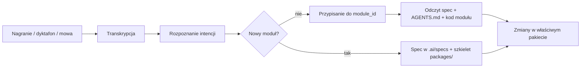

# Open Mercato — workflow głosowy do tworzenia i zmian modułów

**Data:** 2026-05-25  
**Status:** Wymaganie użytkownika — narzędzie do zbudowania  
**Powiązane:** `2026-05-24-sales-forecasting-module-starter-prompt.md` (wzór spec + moduł)

## TLDR

Chcę pracować z Open Mercato tak, że **zaczynam od głosu** (dyktafon, notatka głosowa, luźne słowa), a asystent **wie, który moduł dotykam** po nazwie lub kontekście — np. „stwórz moduł prognoz sprzedaży” albo „w module sales_forecasting zmień to i tamto”. To ma być zapisane jako wspólna umowa na przyszłe narzędzie i na pracę z agentem w repozytorium.

## Cel

1. **Tworzenie nowych modułów** w Open Mercato bez ręcznego klejenia całej struktury od zera — start od intencji głosowej / tekstowej.
2. **Zmiany w istniejącym module** — wystarczy powiedzieć nazwę modułu (lub potoczną nazwę) i co zmienić; agent rozwiązuje ścieżki w kodzie.
3. **Stały kontekst** — każdy moduł ma mapowanie: `module_id` → pakiet → spec → `AGENTS.md`, żeby nie zgadywać „gdzie to leży”.

## Jak pracuję (workflow użytkownika)



### Wejście

- Nagranie z dyktafonu (plik audio) **albo** wklejony tekst po transkrypcji **albo** zwykła wiadomość w czacie („powiedziane słowami”).
- Język: głównie **polski**; identyfikatory techniczne mogą być po angielsku (`sales_forecasting`, `@open-mercato/...`).

### Przykłady wypowiedzi

| Wypowiedź (luźno) | Intencja | Oczekiwane „dotknięcie” |
|-------------------|----------|-------------------------|
| „Chcę moduł do prognozowania przychodów ze sprzedaży” | `create_module` | Nowy spec + pakiet wzorowany na `sales_forecasting` |
| „W module prognoz sprzedaży dodaj filtr po statusie zamówienia” | `change_module` | `sales_forecasting` → `packages/sales-forecasting/...` |
| „Zmień w sales_forecasting endpoint predict — walidacja dat” | `change_module` | Konkretny route w tym module |
| „Zarejestruj moduł w mercato” | `wire_module` | `apps/mercato/src/modules.ts`, `package.json` |

## Rozpoznawanie modułu (ważne)

Narzędzie / agent **MUSI** umieć mapować nazwy potoczne na kanoniczne ID:

| Nazwa potoczna (PL/EN) | `module_id` | Pakiet npm |
|------------------------|-------------|------------|
| prognozy sprzedaży, forecasting, revenue forecast | `sales_forecasting` | `@open-mercato/sales-forecasting` |
| sprzedaż, zamówienia | `sales` | `@open-mercato/core` (moduł w core) |
| webhooki | `webhooks` | `@open-mercato/webhooks` |

**Zasada:** jeśli w wypowiedzi pada **nazwa modułu** (`sales_forecasting`, „moduł X”) — traktuj to jako jednoznaczny scope. Jeśli nie — zapytaj lub wybierz z rejestru ostatnio edytowanych modułów (patrz: plik rejestru poniżej).

## Artefakty w repozytorium (konwencja Open Mercato)

Dla każdego modułu (wzór już użyty przy `sales_forecasting`):

| Artefakt | Ścieżka | Rola |
|----------|---------|------|
| Spec modułu | `.ai/specs/YYYY-MM-DD-<module>-module-starter-prompt.md` | Pełna intencja, MVP, ryzyka, starter prompt dla agenta |
| Wytyczne pakietu | `packages/<kebab-name>/AGENTS.md` | MUST rules, struktura katalogów, checklist |
| Kod modułu | `packages/<kebab-name>/src/modules/<module_id>/` | API, UI, encje, migracje |
| Rejestracja | `apps/mercato/src/modules.ts` | `{ id: '<module_id>', from: '@open-mercato/...' }` |

**Przy każdej sesji głosowej / zmianie** agent powinien:

1. Odczytać **rejestr modułów** (ten plik + `module-registry.yaml` gdy powstanie narzędzie).
2. Odczytać **spec** i **AGENTS.md** modułu, którego dotyczy wypowiedź.
3. Nie edytować innych pakietów bez wyraźnej prośby.

## Rejestr modułów (do utrzymania przez narzędzie)

Plik docelowy (do implementacji w narzędziu): `open-mercato/.ai/module-registry.yaml`

Przykładowa treść startowa (rozszerzaj przy każdym nowym module):

```yaml
modules:
  - id: sales_forecasting
    package: "@open-mercato/sales-forecasting"
    path: packages/sales-forecasting
    spec: .ai/specs/2026-05-24-sales-forecasting-module-starter-prompt.md
    agents: packages/sales-forecasting/AGENTS.md
    aliases_pl:
      - prognozy sprzedaży
      - prognoza przychodów
      - forecasting
    aliases_en:
      - sales forecasting
      - revenue forecast
```

## Intencje (dla parsera / LLM)

| `intent` | Opis | Wyjście |
|----------|------|---------|
| `create_module` | Nowy moduł od zera | Nowy wpis w registry + spec + szkielet `packages/*` |
| `change_module` | Zmiana w istniejącym module | Diff tylko w `path` z registry |
| `wire_module` | Podpięcie do aplikacji | `modules.ts`, zależności w `package.json` |
| `document_module` | Tylko dopisanie spec / notatek | `.ai/specs/*.md` |

## Wymagania na przyszłe narzędzie (do zbudowania przeze mnie)

1. **Ingest** — upload audio lub tekst; opcjonalna transkrypcja (Whisper / usługa zewnętrzna).
2. **Ekstrakcja** — `intent`, `module_id` (lub propozycja nowego), lista zadań w języku naturalnym.
3. **Potwierdzenie** — krótkie podsumowanie: „Dotykam: `packages/sales-forecasting`, pliki: …” przed kodowaniem.
4. **Zapis sesji** — np. `.ai/sessions/YYYY-MM-DD-HHMM-transcript.md` z transkrypcją + rozstrzygniętym `module_id` (audyt: skąd wzięła się zmiana).
5. **Integracja z Cursorem / agentem** — wygenerowany „starter block” jak w spec `sales_forecasting` (sekcja Agent Starter Prompt).

## Starter block dla agenta (szablon)

Używaj po każdej transkrypcji, gdy `module_id` jest znany:

```
Pracujesz nad modułem Open Mercato: <module_id> (<package>).

Wejście użytkownika (głos/transkrypcja):
"""
<wklej transkrypcję>
"""

Przed kodem:
1. Przeczytaj .ai/specs/<spec-plik>.md
2. Przeczytaj packages/<pakiet>/AGENTS.md
3. Potwierdź scope: tylko ten moduł, chyba że wypowiedź mówi inaczej

Zadanie: <jedno zdanie po polsku z transkrypcji>
```

## Przykład sesji (docelowy)

**Transkrypcja:** „W module prognoz sprzedaży dodaj do API możliwość filtrowania po statusie zamówienia, domyślnie tylko złożone.”

**Rozstrzygnięcie:**

- `module_id`: `sales_forecasting`
- `intent`: `change_module`
- Pliki: `api/predict/route.ts`, `lib/aggregateSalesHistory.ts`, testy, i18n

## Zasady dla agenta (MUST)

1. **MUST** rozpoznać moduł z wypowiedzi lub zapytać — nie edytować „na ślepo” core bez powodu.
2. **MUST** czytać spec + `AGENTS.md` przed zmianami w pakiecie.
3. **MUST** przy `create_module` utworzyć spec datowany w `.ai/specs/` zanim powstanie duży diff kodu.
4. **MUST** aktualizować `module-registry.yaml` (gdy istnieje) przy każdym nowym module.
5. **SHOULD** zapisać transkrypcję sesji w `.ai/sessions/` dla traceability.

## Następne kroki (implementacja narzędzia)

- [ ] Skrypt / usługa: audio → tekst → YAML intencji
- [ ] Generator `module-registry.yaml` z `packages/*/src/modules/*`
- [ ] Szablon `create-module` (spec + AGENTS.md + minimalny pakiet)
- [ ] Hook w Cursorze: wklejenie transkrypcji → auto-wstawka Starter block

## Changelog

- **2026-05-25** — Zapis wymagań workflow głosowego (użytkownik: praca przez dyktafon + nazwy modułów).
