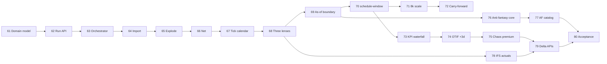

# Master Plan — Module 4: Year Hindsight Replay & Performance Analytics

**Steps 61–80** · Module 4 of 5 · Feeds Module 5 Hindsight dashboard (steps 81–100)

| Field | Value |
|-------|-------|
| **Module** | 4 — Year Hindsight Replay & Performance Analytics |
| **Scope** | 365-day sales load, weekly simulation loop, three-lens replay (perfect hindsight · as-of · IFS actuals), async CP-SAT orchestration (~8,000 solves/year), KPI waterfall, chaos premium, anti-fantasy validation |
| **Depends on** | Modules 1–3 (steps 1–60): entities, CP-SAT bridge, peg-aware chunking, batch/rolling orchestration |
| **Mercato module** | `production_planning` (`apps/mercato/src/modules/production_planning/`) |
| **Solver service** | `services/ortools-scheduler` (FastAPI + CP-SAT) |
| **Queue workers** | `hindsight-orchestrate`, `import`, `explode`, `net`, `schedule-window`, `aggregate-kpis` |

**North star (May 2026):** **Scenario versioning like Kinaxis** (immutable tick × lens snapshots), side-by-side **plan compare** across perfect / as-of / IFS actuals, and **chaos premium** as the quantified **value of concurrency** (information + replan agility) — competitive with o9 Digital Brain EKG, Oracle ASCP compare plans, and Kinaxis concurrent-planning ROI narratives.

**Parity tier key (May 2026 market)**

| Tier | Definition | Vendor anchor |
|------|------------|---------------|
| **P0** | Historical replay fidelity, finite schedule snapshots, OTIF ground truth | Oracle ASCP compare · SAP PP/DS actuals · Opcenter execution trace |
| **P1** | Scenario versioning, multi-lens plan compare, KPI waterfall | Kinaxis scenario library · o9 scenario management · SAP IBP HPA |
| **P2** | Chaos premium = concurrency value, anti-fantasy guardrails, ~8k/year orchestration | o9 control tower · Kinaxis Maestro Agent Studio · SAP RTI |

---

## Scale & replay targets

| Dimension | Target |
|-----------|--------|
| Sales horizon | 365 calendar days rolling |
| Simulation cadence | Weekly loop (52 ticks/year) |
| CP-SAT solves | ~8,000 async solves/year (~154/week tenant avg; burst to 250/week) |
| OTIF definition | On-time if ship/complete ≤ `dueAt + 3 days` grace |
| Replay lenses | **Perfect hindsight** (oracle demand + actuals), **As-of replay** (information available at tick), **IFS actuals** (ERP ground truth) |
| Anti-fantasy | Reject schedules using future demand, retroactive inventory, or post-hoc routing not knowable at as-of tick |
| KPI waterfall | Demand → net → scheduled → shipped → OTIF → chaos premium |

**Owners key**

| Owner | Responsibility |
|-------|----------------|
| **Mercato Backend** | Hindsight entities, workers, replay orchestration, KPI APIs |
| **Solver (Python)** | Window-scoped CP-SAT with as-of constraint masks |
| **Integration** | IFS sales/actuals import adapters |
| **DevOps / SRE** | Year-replay job capacity, queue tuning, back-pressure |
| **QA** | Golden-year fixture, lens parity tests, anti-fantasy regression suite |

---

## Theme map (steps 61–80)

| Steps | Theme |
|-------|-------|
| 61–63 | Hindsight domain model, migrations, replay run registry |
| 64–66 | 365d sales import + explode + net pipeline workers |
| 67–69 | Weekly simulation loop & three-lens semantics |
| 70–72 | `schedule-window` async CP-SAT orchestration (~8k/year) |
| 73–75 | KPI waterfall, OTIF (+3d grace), chaos premium |
| 76–77 | Anti-fantasy validation rules & rejection catalog |
| 78–79 | IFS actuals ingestion & lens reconciliation |
| 80 | Module 4 acceptance gate & handoff to Module 5 UI |

---

## Step 61 — Hindsight replay domain model & migrations

| | |
|---|---|
| **Deliverable** | MikroORM entities + migration: `production_planning_hindsight_runs` (run config, status, lens mode, tick cursor), `production_planning_hindsight_ticks` (week boundary, as-of timestamp, demand snapshot id), `production_planning_hindsight_schedules` (tick × lens × operation rows), `production_planning_hindsight_kpi_snapshots` (waterfall JSON per tick). |
| **Owner** | Mercato Backend |
| **Acceptance criteria** | Migration applies cleanly on fresh and upgraded DB; entities scoped by `tenant_id` + `organization_id`; indexes on `(run_id, tick_index)`, `(run_id, lens, tick_index)`; Zod validators in `data/validators.ts`; no edits under `packages/core`. |
| **Market parity** | **Kinaxis:** Scenario versioning store — run/tick/schedule snapshot schema like concurrent-planning scenario library. **o9:** Digital Brain EKG entity graph for replay lineage. **SAP IBP:** HPA harmonized snapshot tables for PP/DS plan versions. **Oracle ASCP:** Compare-plans genesis pointers at persistence layer. **Opcenter:** Finite schedule snapshot immutability per replay tick. |

---

## Step 62 — Replay run registry API & lifecycle states

| | |
|---|---|
| **Deliverable** | `POST /api/production_planning/hindsight/runs` (create run: horizon, start date, lenses[], OTIF grace days default 3), `GET .../runs/[runId]`, `PATCH .../runs/[runId]` (pause/resume/cancel), `GET .../runs` (list with status filter). States: `draft` → `importing` → `simulating` → `aggregating` → `completed` \| `failed` \| `cancelled`. |
| **Owner** | Mercato Backend |
| **Acceptance criteria** | Invalid date range (>365d or end before start) returns 422; concurrent active run per org blocked with `HINDSIGHT_RUN_ALREADY_ACTIVE`; cancel stops queued child jobs within 60s; run record stores `otifGraceDays: 3` explicitly; ACL requires `production_planning.manage`. |
| **Market parity** | **Kinaxis:** Scenario versioning lifecycle (draft → simulating → completed) like scenario library API. **o9:** Scenario management run registry with pause/resume for control tower. **SAP IBP:** HPA replay run states aligned with planning area promotion. **Oracle ASCP:** Compare-plans run catalog with cancel and status filter. **Kinaxis Maestro:** Guardrails — one active concurrent replay per org. |

---

## Step 63 — `hindsight-orchestrate` worker skeleton & job graph

| | |
|---|---|
| **Deliverable** | Queue `production_planning_hindsight_orchestrate` + worker `workers/hindsight-orchestrate.ts`: on run start, enqueue ordered stages (`import` → `explode` → per-tick chain `net` → `schedule-window` × N → tick `aggregate-kpis` → final rollup); persist job graph on run (`orchestrationJson`); resume from last completed tick after failure. |
| **Owner** | Mercato Backend |
| **Acceptance criteria** | Worker id `production_planning:hindsight-orchestrate`, concurrency 1 per org; graph reconstructable from DB after worker crash; dry-run mode validates graph without solver calls; events emitted: `production_planning.hindsight.run.started`, `.tick.completed`, `.run.completed`. |
| **Market parity** | **Kinaxis:** Concurrent planning orchestration graph — resume after failure like scenario replay. **o9:** APEX continuous planning job DAG for ~8k solves/year. **SAP IBP:** RTI orchestrated PP/DS window chain. **Oracle ASCP:** Compare-plans multi-stage pipeline registry. **o9 control tower:** Event feed for replay progress (Module 5 handoff). |

---

## Step 64 — `import` worker: 365-day sales load

| | |
|---|---|
| **Deliverable** | Worker `workers/hindsight-import.ts`: pull sales orders + lines for `[run.startDate, run.startDate + 365d)` from Mercato `sales` module and/or IFS adapter stub; normalize to `production_planning_hindsight_demand_rows` (order id, line id, sku, qty, requested date, customer priority); idempotent upsert keyed by `(run_id, source_ref)`. |
| **Owner** | Mercato Backend + Integration |
| **Acceptance criteria** | Full-year import for 10k lines completes in ≤10 min on staging; duplicate run import does not double-count; missing SKU flagged `importWarning` not silent drop; import records `rowCount`, `minDate`, `maxDate`; IFS path behind feature flag `production_planning.ifs_import`. |
| **Market parity** | **o9:** Digital Brain demand ingest for 365d EKG baseline. **SAP IBP:** HPA harmonized demand load for PP/DS replay. **Kinaxis:** Scenario versioning demand snapshot id per run (concurrent planning input). **Oracle ASCP:** Compare-plans demand horizon import. **Oracle ASCP CTP:** 365d sales load for capacity-to-promise replay. |

---

## Step 65 — `explode` worker: BOM / routing explosion

| | |
|---|---|
| **Deliverable** | Worker `workers/hindsight-explode.ts`: explode demand rows to production order candidates via existing `production-order` bridge + BOM tables (or synthetic fixture BOM); emit `explodedOperationsJson` per demand row; respect `assemblyLinks` peg closure for downstream chunking. |
| **Owner** | Mercato Backend |
| **Acceptance criteria** | Explosion deterministic for same input hash; multi-level BOM produces correct operation count; unmapped SKU → `EXPLODE_SKU_NO_BOM` on row, run continues with warnings; output feeds peg-aware chunking from Module 3 without schema change. |
| **Market parity** | **SAP IBP:** PP/DS explosion with peg closure for finite replay. **Kinaxis:** Concurrent planning BOM/routing explosion into scenario ops. **o9:** Scenario management exploded op graph for plan compare. **Opcenter / Asprova:** Finite Gantt operation set from demand explosion. **Oracle ASCP:** Compare-plans exploded requirement baseline. |

---

## Step 66 — `net` worker: as-of netting & inventory mask

| | |
|---|---|
| **Deliverable** | Worker `workers/hindsight-net.ts`: at each weekly tick, net exploded demand against inventory snapshot **as-of tick** (no future receipts); produce `netRequirementsJson` per tick with peg clusters; separate inventory masks for **as-of replay** vs **perfect hindsight** (oracle sees true end-of-week inventory). |
| **Owner** | Mercato Backend |
| **Acceptance criteria** | As-of lens never consumes inventory with `availableAt > tick.asOfAt`; perfect hindsight lens may use realized inventory from full-year oracle file; net output op count stable week-over-week unless demand changes; unit tests cover partial stock, negative net clamped to zero. |
| **Market parity** | **Kinaxis:** Scenario versioning — as-of vs oracle inventory masks (anti-fantasy boundary). **o9:** Digital Brain EKG netting as-of cut for replay lens. **SAP IBP:** HPA harmonized net requirements; RTI as-of inventory. **Oracle ASCP:** Compare-plans net vs gross waterfall stage. **Kinaxis Maestro:** Guardrails — no future receipt in as-of lens. |

---

## Step 67 — Weekly simulation loop & tick calendar

| | |
|---|---|
| **Deliverable** | `lib/hindsight/tick-calendar.ts`: generate 52 weekly ticks from run config (ISO week boundaries, configurable anchor weekday); each tick carries `asOfAt`, `windowStartAt`, `windowEndAt` (default 168h forward), `freezeHorizonHours` (carry-forward from Module 3); orchestrator advances cursor only after tick KPI persist. |
| **Owner** | Mercato Backend |
| **Acceptance criteria** | 365d run produces exactly 52 ticks (partial final week merged per config); leap-year boundary handled; tick `windowEndAt` never exceeds run horizon; replay resume starts at `lastCompletedTickIndex + 1`; calendar unit tests include year boundary fixtures. |
| **Market parity** | **o9:** APEX continuous planning weekly tick cadence (52/year). **Kinaxis:** Concurrent planning rolling tick calendar for scenario versioning. **SAP IBP:** PP/DS rolling window calendar in HPA replay. **Oracle ASCP:** Compare-plans time-phased buckets. **Opcenter:** Finite Gantt weekly replan boundary alignment. |

---

## Step 68 — Three-lens replay semantics

| | |
|---|---|
| **Deliverable** | Lens enum `perfect_hindsight` \| `as_of_replay` \| `ifs_actuals` documented in `lib/hindsight/lenses.ts`: **Perfect hindsight** — oracle demand, realized routings/WC availability, no information constraint; **As-of replay** — demand/inventory/routing knowable at `tick.asOfAt` only; **IFS actuals** — no CP-SAT schedule write, load ERP actual start/end/shipment timestamps for comparison. |
| **Owner** | Mercato Backend + Product / Planning SME |
| **Acceptance criteria** | Each lens produces distinct schedule rows where applicable; as-of lens fails anti-fantasy if oracle-only fields leak (Step 76); IFS lens skips `schedule-window` enqueue; lens metadata stored on every schedule row; SME sign-off on lens definitions recorded in spec appendix. |
| **Market parity** | **Kinaxis:** Scenario versioning — three-lens compare like baseline / constrained / actual scenario set. **o9:** Scenario management + Digital Brain EKG multi-lens replay. **Oracle ASCP:** Compare-plans lens definitions (optimal vs constrained vs actuals). **SAP IBP:** HPA perfect vs operational vs ERP actuals lenses. **Kinaxis Maestro:** Guardrails on lens semantics (no fantasy definitions). |

---

## Step 69 — As-of information boundary & routing freeze

| | |
|---|---|
| **Deliverable** | `lib/hindsight/as-of-boundary.ts`: filter demand, inventory, capacity, and routing alternatives to as-of cut; freeze in-progress operations from prior tick schedules into `fixedOperations`; block alt-routing options added after `asOfAt`. |
| **Owner** | Mercato Backend |
| **Acceptance criteria** | Synthetic test: engineering change effective week 30 invisible in week 20 as-of replay; fixed ops from week N-1 appear in week N payload; boundary violations logged with `AS_OF_LEAK_*` codes; perfect hindsight bypasses filter with explicit `lens` flag in builder. |
| **Market parity** | **Kinaxis:** Scenario versioning information cut — knowable-at-date filter (concurrent planning as-of). **o9:** APEX as-of boundary for continuous planning scenarios. **SAP IBP:** PP/DS effectivity / RTI routing freeze at tick. **Kinaxis Maestro:** Agent Studio guardrails — `AS_OF_LEAK_*` anti-fantasy codes. **Oracle ASCP:** Compare-plans constrained vs unconstrained information set. |

---

## Step 70 — `schedule-window` worker: async CP-SAT per tick

| | |
|---|---|
| **Deliverable** | Worker `workers/hindsight-schedule-window.ts`: for each `(tick, lens)` where lens ∈ `{perfect_hindsight, as_of_replay}`, build payload via `build-cpsat-payload.ts` + Module 3 batch/rolling; enqueue existing `cpsat-optimize` jobs with `hindsightRunId`, `tickIndex`, `lens`; persist merged schedule to `production_planning_hindsight_schedules`; do not mutate live `production_planning_operations`. |
| **Owner** | Mercato Backend |
| **Acceptance criteria** | Schedule rows are immutable snapshots keyed by `(run_id, tick_index, lens, operation_id)`; dry-run on run produces zero live table writes; failed chunk aborts tick with partial schedule flagged; solver meta (chunk count, strategy, objective) copied to schedule header JSON. |
| **Market parity** | **Kinaxis:** Scenario versioning immutable snapshots per tick — like Kinaxis scenario library entries. **o9:** Scenario management schedule-window solve without live plan mutation. **SAP IBP:** PP/DS finite window solve; RTI snapshot publish (no live overwrite). **Oracle ASCP:** Compare-plans versioned schedule artifact per window. **Opcenter / PlanetTogether:** What-if sandbox — snapshot only, no shop-floor write. |

---

## Step 71 — Async orchestration at ~8,000 solves/year scale

| | |
|---|---|
| **Deliverable** | Capacity model + queue tuning: `lib/hindsight/solve-budget.ts` estimates solves/run (`ticks × lenses × chunks_per_tick`); orchestrator respects `HINDSIGHT_MAX_INFLIGHT_SOLVES` (default 8); priority queue lane for hindsight jobs below live `POST /optimize`; back-pressure pauses tick dispatch when bridge p95 > threshold; run projects ~8,000 solves/year at default factory profile documented. |
| **Owner** | Mercato Backend + DevOps / SRE |
| **Acceptance criteria** | Full-year replay on golden fixture completes ≤24h wall time with 4 vCPU bridge; solve count within ±10% of 8,000 baseline; live optimize p99 latency unaffected (<5% regression vs Module 3 baseline); inflight cap enforced in integration test; metrics: `hindsight_solves_total`, `hindsight_tick_duration_ms`. |
| **Market parity** | **Kinaxis:** Concurrent planning at ~8k solves/year — chaos premium input = value of concurrency under load. **o9:** APEX + Digital Brain EKG scale; back-pressure below live control tower. **SAP IBP:** RTI inflight cap for PP/DS finite replay fleet. **Oracle ASCP:** Compare-plans batch orchestration without starving CTP live path. **Kinaxis Maestro:** Guardrails — live optimize p99 isolation from replay burst. |

---

## Step 72 — Window chaining, carry-forward & replan deduplication

| | |
|---|---|
| **Deliverable** | Cross-tick carry-forward: week N `fixedOperations` + `workCenterFloors` seeded from week N-1 final schedule per lens; dedupe identical consecutive solves via payload hash skip (`scheduleSkipped: true`); replan counter on order when material schedule change > configurable threshold (default 4h shift). |
| **Owner** | Mercato Backend |
| **Acceptance criteria** | 52-tick run shows monotonic non-overlap on carry-forward WCs; skipped solves do not increment solve budget counter; replan count exposed per order in tick metadata; peg-linked orders replan atomically (same tick index). |
| **Market parity** | **Kinaxis:** Scenario versioning warm-start — carry-forward + dedupe like concurrent scenario re-solve. **o9:** APEX continuous planning tick chain with skip-on-unchanged payload. **SAP IBP:** PP/DS floor carry + RTI incumbent between windows. **Oracle ASCP:** Compare-plans replan count between consecutive versions. **Opcenter / PlanetTogether:** Finite Gantt freeze + replan threshold parity. |

---

## Step 73 — KPI waterfall schema & `aggregate-kpis` worker

| | |
|---|---|
| **Deliverable** | Worker `workers/hindsight-aggregate-kpis.ts`: per tick compute waterfall stages — `grossDemandQty` → `explodedQty` → `nettedQty` → `scheduledQty` → `shippedQty` → `otifQty`; persist to `production_planning_hindsight_kpi_snapshots`; rollup series at run completion. |
| **Owner** | Mercato Backend |
| **Acceptance criteria** | Waterfall stages sum-consistency checks pass (netted ≤ exploded, etc.); missing stage yields null not zero conflation; API `GET /api/production_planning/hindsight/runs/[runId]/kpis?lens=&tick=` returns waterfall JSON; worker runs after all schedule-window jobs for tick complete. |
| **Market parity** | **o9:** Digital Brain EKG KPI waterfall — demand → net → scheduled → shipped. **Kinaxis:** Scenario compare waterfall across scenario versions. **SAP IBP:** HPA KPI cascade for PP/DS replay. **Oracle ASCP:** Compare-plans waterfall totals for side-by-side diff. **o9 control tower:** Waterfall feed for exception triage (Module 5). |

---

## Step 74 — OTIF with +3 day grace

| | |
|---|---|
| **Deliverable** | `lib/hindsight/otif.ts`: OTIF true when `shippedAt ≤ dueAt + graceDays` (default **3**) AND shipped qty ≥ ordered qty (partial shipment rules configurable); compute per order, line, and aggregate; store `otifHit`, `daysLate`, `graceUsedDays` on KPI snapshot. |
| **Owner** | Mercato Backend + Product / Planning SME |
| **Acceptance criteria** | Order due Monday shipped Thursday grace=3 → OTIF hit; shipped Friday → miss; grace override per run (0–7 days) validated; lens comparison: perfect hindsight OTIF ≥ as-of replay OTIF on same fixture (oracle advantage); unit tests cover timezone boundaries. |
| **Market parity** | **Oracle ASCP:** Compare-plans OTIF / service-level lens across scenarios. **Kinaxis:** Scenario versioning OTIF delta — perfect vs as-of (plan compare KPI). **o9:** Control tower OTIF with configurable grace. **SAP IBP:** HPA service KPI with tolerance days. **Opcenter:** Finite schedule lateness vs actual OTIF reconciliation. |

---

## Step 75 — Chaos premium metric

| | |
|---|---|
| **Deliverable** | `lib/hindsight/chaos-premium.ts`: quantify cost of variability — `chaosPremium = actualCost − perfectHindsightCost` where cost = tardiness penalty + changeover + overtime proxy + expedite flags; normalized `chaosPremiumPct` vs revenue-at-risk; stored per tick and run summary. |
| **Owner** | Mercato Backend + Product / Planning SME |
| **Acceptance criteria** | Chaos premium ≥ 0 for all golden fixtures; decomposition JSON lists top-5 contributing orders; as-of replay premium ≥ 0 vs perfect hindsight on same tick; formula documented with weight constants in module spec; zero-demand tick returns null premium not divide-by-zero. |
| **Market parity** | **North star:** **Chaos premium = value of concurrency** — cost of as-of / actual vs perfect hindsight (information + replan agility). **Kinaxis:** Concurrent planning ROI metric — scenario premium vs oracle baseline. **o9:** Digital Brain EKG variability cost decomposition. **Oracle ASCP:** Compare-plans cost delta between plan versions. **SAP IBP:** HPA plan gap / premium vs optimal finite schedule. |

---

## Step 76 — Anti-fantasy validation rules (core)

| | |
|---|---|
| **Deliverable** | `lib/hindsight/anti-fantasy.ts` rule engine validating schedules and KPI inputs before persist: **AF-01** no demand with `createdAt > asOfAt`; **AF-02** no inventory receipt dated after as-of consumed in as-of lens; **AF-03** no routing/WC capacity from future engineering effective date; **AF-04** no solver horizon extending beyond knowable calendar; **AF-05** shipped actuals cannot precede schedule start in IFS lens joins. |
| **Owner** | Mercato Backend + QA |
| **Acceptance criteria** | Violations block persist with `ANTI_FANTASY_VIOLATION` and rule id; perfect hindsight runs log warnings not hard-fail on AF-01..04 unless `strictMode: true`; validation runs in `schedule-window` post-solve and `aggregate-kpis` pre-write; ≥10 unit tests, one per rule + composite. |
| **Market parity** | **Kinaxis Maestro:** Agent Studio guardrails — anti-fantasy rule engine (not fantasy schedules). **o9:** Scenario management integrity checks before EKG persist. **SAP IBP:** RTI publish validation — no future information in operational lens. **Oracle ASCP:** Compare-plans constrained-lens eligibility rules. **Kinaxis:** Concurrent planning as-of integrity (AF-01..05 class). |

---

## Step 77 — Anti-fantasy rejection catalog & operator diagnostics

| | |
|---|---|
| **Deliverable** | Error catalog `HINDSIGHT_AF_*` mapped to i18n; `GET /api/production_planning/hindsight/runs/[runId]/violations` lists rule, tick, lens, entity ref, remediation hint; run summary includes `antiFantasyRejectCount` and `strictMode`. |
| **Owner** | Mercato Backend |
| **Acceptance criteria** | Each code has operator-facing text in `i18n/en.json`; violations exportable CSV; strict mode aborts run on first AF violation; non-strict continues with tick marked `integrity: degraded`; Module 5 Overview can surface reject count (API contract documented). |
| **Market parity** | **o9 control tower:** Exception catalog for replay integrity violations (Module 5 exceptions feed). **Kinaxis Maestro:** Guardrails operator diagnostics + remediation hints. **Kinaxis:** Scenario versioning reject count on scenario compare summary. **Oracle ASCP:** Compare-plans validation export for audit. **SAP IBP:** HPA replay integrity report. |

---

## Step 78 — IFS actuals ingestion (`ifs_actuals` lens)

| | |
|---|---|
| **Deliverable** | Import adapter `lib/hindsight/ifs-actuals-import.ts` + worker stage: load shop order operation actuals (start, end, qty good/scrap, shipment date) from IFS API or CSV fixture into `production_planning_hindsight_actuals`; join key `(orderRef, operationRef, sku)`. |
| **Owner** | Integration + Mercato Backend |
| **Acceptance criteria** | ≥95% match rate on golden-year fixture; unmatched rows in `actuals_orphan` table with reason; actuals never overwrite CP-SAT snapshot tables; import idempotent; feature flag `production_planning.ifs_import` gates traffic; PII redacted in logs. |
| **Market parity** | **Oracle ASCP:** Compare-plans actuals leg — ERP ground truth for plan compare. **SAP IBP:** PP/DS execution feedback vs planned (RTI actuals). **Kinaxis:** Scenario versioning IFS/ERP actuals lens for side-by-side compare. **o9:** Digital Brain EKG actuals overlay on scenario timeline. **Opcenter / PlanetTogether:** Shop-floor actual timestamps for delta tab. |

---

## Step 79 — Lens reconciliation & delta primitives (API for Module 5)

| | |
|---|---|
| **Deliverable** | APIs consumed by Module 5 Delta tab (no UI in Module 4): `GET /api/production_planning/hindsight/runs/[runId]/delta?lensA=&lensB=&tick=` returning per-order Δ start, Δ end, Δ tardiness, replan count; `GET .../lens-summary` comparing OTIF, chaos premium, waterfall totals across three lenses; genesis pointers (`sourceRunId`, `tickIndex`, `solverJobId`) on schedule rows. |
| **Owner** | Mercato Backend |
| **Acceptance criteria** | Delta between `ifs_actuals` and `perfect_hindsight` matches manual spot-check ±0.1% on tardiness aggregate; missing lens data excluded with explicit counts; response time ≤3s for single tick; OpenAPI-style Zod schemas exported for Module 5 consumers. |
| **Market parity** | **North star:** **Plan compare** API — lens A vs lens B Δ start/end/tardiness (Kinaxis scenario compare parity). **Oracle ASCP:** Compare-plans delta primitives per order/WC. **Kinaxis:** Scenario versioning side-by-side diff with genesis pointers. **o9:** Scenario management + control tower delta summary feed. **SAP IBP:** HPA plan compare across PP/DS versions. |

---

## Step 80 — Module 4 acceptance gate & handoff to Module 5

| | |
|---|---|
| **Deliverable** | Signed acceptance report + runbook section `docs/production-planning/hindsight-replay-runbook.md`: golden-year replay SLOs, queue capacity planning, failure recovery, strict vs non-strict anti-fantasy policy; handoff checklist for Module 5 dashboard (APIs 79, KPI snapshots, actuals, violation feed). |
| **Owner** | QA + Product / Planning SME + DevOps / SRE |
| **Acceptance criteria** | Golden-year fixture (365d, 52 ticks, 3 lenses) completes with all SLOs pass: replay ≤24h, ~8k solves ±10%, OTIF grace=3 verified, chaos premium computed, anti-fantasy suite green; Module 5 Step 87 delta API unblocked; known gaps logged with severity; SME + PM sign-off recorded; `AGENTS.md` updated with hindsight workers and env vars. |
| **Market parity** | **Kinaxis:** Scenario versioning like Kinaxis — full-year library entry with 3-lens compare sign-off. **Oracle ASCP:** Compare-plans program acceptance at 365d horizon. **o9:** Digital Brain EKG + control tower handoff SLOs documented. **Chaos premium:** Value-of-concurrency metric validated in acceptance report. **Kinaxis Maestro:** Anti-fantasy guardrails policy (strict vs degraded) signed for Module 5 copilot bounds. |

---

## Module 4 dependency graph

---

## Worker & queue registry (Module 4)

| Worker id | Queue | Trigger | Output |
|-----------|-------|---------|--------|
| `production_planning:hindsight-orchestrate` | `production_planning_hindsight_orchestrate` | Run create / resume | Job graph, tick cursor |
| `production_planning:hindsight-import` | `production_planning_hindsight_import` | Orchestrator stage 1 | Demand rows (365d) |
| `production_planning:hindsight-explode` | `production_planning_hindsight_explode` | Post-import | Exploded operations |
| `production_planning:hindsight-net` | `production_planning_hindsight_net` | Per tick | Net requirements |
| `production_planning:hindsight-schedule-window` | `production_planning_hindsight_schedule_window` | Per tick × lens | Schedule snapshots → CP-SAT |
| `production_planning:hindsight-aggregate-kpis` | `production_planning_hindsight_aggregate_kpis` | Post tick schedules | KPI waterfall + OTIF + chaos |

Existing Module 3 worker `production_planning:cpsat-optimize` is **reused** for each window solve (not duplicated).

---

## Environment variables (Module 4 additions)

| Variable | Default | Purpose |
|----------|---------|---------|
| `HINDSIGHT_MAX_INFLIGHT_SOLVES` | `8` | Back-pressure cap for concurrent hindsight CP-SAT jobs |
| `HINDSIGHT_DEFAULT_OTIF_GRACE_DAYS` | `3` | Default OTIF grace window |
| `HINDSIGHT_SOLVE_DEDUPE` | `true` | Skip identical consecutive window payloads |
| `HINDSIGHT_STRICT_ANTI_FANTASY` | `false` | Hard-fail run on AF violations |
| `HINDSIGHT_REPLAY_PRIORITY` | `low` | Queue priority vs live optimize |

---

## Owner roster (Module 4)

| Owner | Steps |
|-------|-------|
| Mercato Backend | 61, 62, 63, 65, 66, 67, 68, 69, 70, 72, 73, 74, 75, 76, 77, 79 |
| Mercato Backend + Integration | 64, 78 |
| Mercato Backend + DevOps / SRE | 71 |
| Mercato Backend + QA | 76 |
| QA + Product / Planning SME + DevOps / SRE | 80 |
| Product / Planning SME | 68, 74, 75 (formula sign-off) |

---

## Out of scope (Module 4)

- Hindsight dashboard UI (Module 5, steps 81–88)
- ACL feature matrix beyond existing `production_planning.manage` / `view` (Module 5, step 89)
- IFS schedule write-back (Module 5, steps 98–99)
- Live `production_planning_operations` mutation during replay (snapshots only)
- Embedding OR-Tools in Node

---

## References

- `.ai/specs/2026-05-24-production-planning-module-3-cpsat-scale-master-plan.md` (steps 41–60)
- `.ai/plans/master-plan-module-5-mercato-ui-governance-industrialization-steps-81-100.md` (downstream consumer)
- `.ai/specs/2026-05-23-production-planning-cpsat-ortools.md`
- `apps/mercato/src/modules/production_planning/AGENTS.md`
