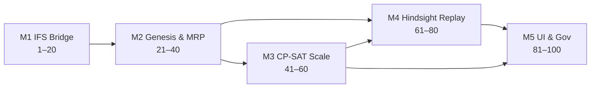

# Master Plan — Production Planning & Year Hindsight (100 kroków · 5 modułów)

**Wersja:** 1.0 · **2026-05-24  
**Kontekst:** Oracle **IFS9** = logika i prawda operacyjna · **Open Mercato** = planowanie, geneza drzew, CP-SAT, analiza retrospektywna  
**Stan kodu:** moduł `production_planning` + `ortools-scheduler` (CP-SAT, chunking 500, rolling 600+) — PR #10

---

## Cel programu

1. **Operacyjnie:** skończone moce na 150 gniazdach, terminy klientów (+3 dni tolerancji), wspólne półprodukty, warianty technologii.  
2. **Analitycznie:** test **365 dni sprzedaży** → drzewa **genesis** → plan referencyjny vs **IFS actuals** → odpowiedź: *ile dało się uratować vs „gdzie popadnie”*.  
3. **Technicznie:** CP-SAT **nie wisi** — dekompozycja (netting, chunk, rolling, async), nie jeden monolit.

---

## Pięć modułów

| Moduł | Kroki | Deliverable biznesowy | Szczegóły |
|-------|-------|----------------------|-----------|
| **M1** IFS9 Data Bridge | 1–20 | Dane 365d w Mercato (read-only) | [module-1-ifs-bridge.md](./2026-05-24-production-planning-module-1-ifs-bridge.md) |
| **M2** Genesis & Netting | 21–40 | Eksplozja BOM, pool MO, pegi, provenance | [module-2-genesis-netting.md](./2026-05-24-production-planning-module-2-genesis-netting.md) |
| **M3** CP-SAT Engine | 41–60 | Skalowanie solvera + optimize API | [module-3-cpsat-scale.md](./2026-05-24-production-planning-module-3-cpsat-scale-master-plan.md) |
| **M4** Hindsight Replay | 61–80 | Roczna symulacja + KPI | [../plans/master-plan-module-4-year-hindsight-replay-performance-analytics-steps-61-80.md](../plans/master-plan-module-4-year-hindsight-replay-performance-analytics-steps-61-80.md) |
| **M5** UI & Industrialization | 81–100 | Dashboard, ACL, runbooki, go-live | [../plans/master-plan-module-5-mercato-ui-governance-industrialization-steps-81-100.md](../plans/master-plan-module-5-mercato-ui-governance-industrialization-steps-81-100.md) |

---

## Fazy wdrożenia (bramki)

| Faza | Kroki | Bramka (go/no-go) |
|------|-------|-------------------|
| **F0** Fundament | 1–20 | Import IFS 365d reconciled; optimize bez IFS w runtime |
| **F1** MRP | 21–40 | Genesis tree + pool MO na 500+ demand lines/mies. |
| **F2** Solver | 41–60 | 150 WC / 500 ops chunk / p95 solve <120s |
| **F3** Hindsight | 61–80 | Roczny run completed; 3 soczewki KPI |
| **F4** Produkcja | 81–100 | Dashboard + runbooki; pilot 2 tygodnie |

**Równoległość:** po F0 można F2 (M3) na fixture bez IFS; F3 wymaga F1+F2.

---

## Role

| Rola | Moduły |
|------|--------|
| **Integration / Data** | M1 |
| **MRP / Backend** | M2, M3, M4 |
| **Solver (Python)** | M3, M4 |
| **Frontend** | M5 |
| **Planner SME** | UAT M1, M2, M5 |
| **SRE / DevOps** | M1, M4, M5 |
| **Product Owner** | Bramki faz |

---

## KPI sukcesu programu

| KPI | Cel |
|-----|-----|
| OTIF@+3d (hindsight perfect) | Górny pułag vs actual |
| Chaos premium | Zmierzony (plan referencyjny vs actual) |
| CP-SAT solve | ≤500 ops, p95 <120s (MEDIUM tier) |
| Genesis coverage | 100% demand lines z drzewem |
| IFS reconcile | ±0.1% wierszy CO |
| Anti-fantasy | 0 krytycznych naruszeń AF-01..05 w audycie |

---

## 100 kroków — skrót (tabela)

### Moduł 1 — IFS9 Data Bridge (1–20)

| # | Krok | Deliverable | Owner |
|---|------|-------------|-------|
| 1 | Inwentaryzacja źródeł IFS9 | Data dictionary | Data |
| 2 | ADR read-only Mercato↔IFS | Architektura | Dev |
| 3 | Polityka okna 365 dni | Reguły dat | Planner |
| 4 | DDL staging bronze | Migracje | Data |
| 5 | Model silver (canonical) | ERD + DDL | Dev |
| 6 | Connector extract | JDBC/API | Dev |
| 7 | Extract CO/sales 365d | Job | Data |
| 8 | Extract shop orders | Job | Data |
| 9 | Extract operacje | Job | Data |
| 10 | Extract SUPPLY_DEMAND | Pegging | Data |
| 11 | Extract kalendarze WC | Capacity | Data |
| 12 | Extract MANUF_OPERATION_FEEDBACK | Actuals | Data |
| 13 | Extract BOM + effectivity | Struktury | Data |
| 14 | Transform + surrogate keys | ETL | Dev |
| 15 | DQ + reconciliation | Raporty | Data |
| 16 | Orchestracja backfill | Scheduler | Dev |
| 17 | Read API dla modułu | API | Dev |
| 18 | Incremental + late data | Watermark | Dev |
| 19 | UAT planistów | Sign-off | Planner |
| 20 | Runbook + monitoring | Ops | Dev |

### Moduł 2 — Genesis Trees & Netting (21–40)

| # | Krok | Deliverable | Owner |
|---|------|-------------|-------|
| 21 | Resolver wariantów technologii | `resolve-variant-tree` | MRP |
| 22 | Eksplozja BOM 6 poziomów | `explode.ts` | MRP |
| 23 | Materializacja genesis_roots | Per demand line | Platform |
| 24 | Graf genesis_nodes | Drzewo | MRP |
| 25 | Time-bucket gross req | Tygodnie/dni | MRP |
| 26 | Snapshot podaży | On-hand, WIP | Integrations |
| 27 | Net requirements | Lot sizing | MRP |
| 28 | Reguły pool MO | Konsolidacja SF | MRP |
| 29 | Generator MO (discrete/pool) | Proposals | MRP |
| 30 | Pegging many-to-one | `pegging_links` | MRP |
| 31 | mo_provenance audit | Append-only | Platform |
| 32 | Incremental replan | Delta roots | MRP |
| 33 | Worker mrp-netting-run | API run | Platform |
| 34 | UI genesis explorer | Strona drzewa | UI |
| 35 | Zakładka pegging na SO | Injection | UI |
| 36 | Pool MO workbench | Release/split | UI |
| 37 | Performance 1000+ SO/mies. | Load test | Platform |
| 38 | Alerty + exceptions | Observability | Platform |
| 39 | Testy integracyjne golden | CI | QA |
| 40 | Cutover M2 sign-off | Gate → M3 | Product |

### Moduł 3 — CP-SAT Engine & Scale (41–60)

| # | Krok | Deliverable | Owner |
|---|------|-------------|-------|
| 41 | Benchmark 150 WC / 2500 ops | `benchmarks/` | QA+Solver |
| 42 | Schema assemblyLinks | Mercato+Python | Dev |
| 43 | Schema changeoverGroups | Mercato+Python | Solver |
| 44 | Schema routingAlternatives | Payload | Dev |
| 45 | CP-SAT assembly constraints | Python | Solver |
| 46 | Optional intervals (FJSP) | Python | Solver |
| 47 | Changeover groups w solverze | Python | Solver |
| 48 | Peg-aware chunking | TS | Mercato |
| 49 | Harden floors + fixed ops | Batch solve | Mercato |
| 50 | Rolling 600+ @ 150 WC | Python | Solver |
| 51 | Batch orchestration | `runSequentialBatchSchedule` | Mercato |
| 52 | Integracja POST /optimize | API | Mercato |
| 53 | Profilowanie pamięci 150 WC | Raport | SRE |
| 54 | Tune LARGE profile | Python | Solver |
| 55 | Load-test CI gate | Harness | QA |
| 56 | Observability chunk/window | Metrics | SRE |
| 57 | Failure modes + i18n | UX errors | Mercato |
| 58 | E2E Mercato↔Python | Tests | QA |
| 59 | Gate wydajności M3 | Sign-off | QA |
| 60 | Runbook solver + handoff | Docs | SRE |

### Moduł 4 — Year Hindsight Replay (61–80)

| # | Krok | Deliverable | Owner |
|---|------|-------------|-------|
| 61 | Encje hindsight_* | Migracje | Backend |
| 62 | API runs lifecycle | CRUD + states | Backend |
| 63 | Worker hindsight-orchestrate | Job graph | Backend |
| 64 | Worker import 365d | Demand rows | Backend+IFS |
| 65 | Worker explode | BOM w run | Backend |
| 66 | Worker net (as-of) | Partie | Backend |
| 67 | Kalendarz 52 ticków | Weekly loop | Backend |
| 68 | 3 soczewki: perfect / as-of / actual | Semantyka | Product |
| 69 | Granica informacji as-of | Reguły | Product |
| 70 | Worker schedule-window | CP-SAT async | Backend |
| 71 | Back-pressure ~8k solves/rok | Queue tuning | SRE |
| 72 | Carry-forward między tickami | State | Backend |
| 73 | Worker aggregate-kpis | Waterfall | Backend |
| 74 | OTIF +3d grace | KPI | Backend |
| 75 | Chaos premium | KPI | Backend |
| 76 | Anti-fantasy AF-01..05 | Validator | Backend |
| 77 | Katalog odrzuceń raportu | Docs | Product |
| 78 | Lens IFS actuals | Import actuals | Integration |
| 79 | API delta dla UI M5 | Contracts | Backend |
| 80 | Gate M4 → M5 | Sign-off | Product |

### Moduł 5 — UI, Governance & Go-Live (81–100)

| # | Krok | Deliverable | Owner |
|---|------|-------------|-------|
| 81 | Shell hindsight + nav | Route | Frontend |
| 82 | Overview KPIs | Tab | Full-stack |
| 83 | Gantt 150 WC virtualized | Tab | Frontend |
| 84 | Gantt conflicts + drill-down | UX | Frontend |
| 85 | Genesis tree drill-down | Tab | Full-stack |
| 86 | Heatmap 3D tolerance | Tab | Full-stack |
| 87 | Delta actual vs optimal | Tab | Full-stack |
| 88 | PDF export | Async job | Full-stack |
| 89 | ACL feature matrix | acl.ts | Backend |
| 90 | Scoping WC/site | RLS pattern | Backend |
| 91 | CI gates modułu | Pipeline | DevOps |
| 92 | Deploy ortools + mercato | K8s/Docker | DevOps |
| 93 | Monitoring bridge | Alerts | SRE |
| 94 | Monitoring optimize jobs | Dashboard | SRE |
| 95 | Runbook dzienny planisty | PDF/wiki | Product |
| 96 | Runbook awarie bridge | PDF/wiki | SRE |
| 97 | Runbook interpretacji hindsight | Szkolenie | Product |
| 98 | Design IFS write-back (opt.) | ADR | Integration |
| 99 | Pilot write-back (opt.) | Flag | Integration |
| 100 | Go-live checklist | Sign-off BAU | PM |

---

## Porównanie z rynkiem (skrót debaty ekspertów)

| Podejście rynkowe | Gdzie w master planie |
|------------------|----------------------|
| Kinaxis / o9 / OMP scenariusze | M4 soczewki + M5 what-if UI |
| Oracle ASCP Compare Plans | M4 delta + M5 |
| Opcenter / PlanetTogether what-if | M3 optimize + M5 Gantt |
| Asprova historia KPI | M4 aggregate + M5 Overview |
| MES plan attainment | M1 actuals + M5 delta |
| **Genesis tree + roczny replay** | **M2 + M4 (nisza produktowa)** |

---

## Ryzyka programu

| Ryzyko | Mitigacja (krok) |
|--------|------------------|
| CP-SAT timeout | 48, 50, 51, 71 |
| Fantasy hindsight | 76, 77, 69 |
| IFS schema drift | 1, 15, 18 |
| 1000+ SO eksplozja MO | 28, 37 |
| Brak buy-in planistów | 19, 95, 97 |
| Koszt compute 8k solves | 71, 55 |

---

## Następna akcja (dla zespołu)

1. **Zatwierdzić** F0 scope: widoki IFS + definicja 365d (krok 3).  
2. **Uruchomić** równolegle: M1 kroki 1–6 oraz M3 krok 48 (peg-aware chunking — częściowo done).  
3. **Zarezerwować** środowisko: worker pool na M4 (min. 16 równoległych `schedule-window`).  
4. **Pilot:** jeden rok kalendarzowy + jedna organizacja przed multi-tenant.

---

*Dokument zsyntetyzowany z debat 10 subagentów-specjalistów (IFS, MRP, CP-SAT, hindsight, UI, Kinaxis/SAP/o9/Opcenter/Asprova benchmarks) oraz stanu repo `production_planning`.*
