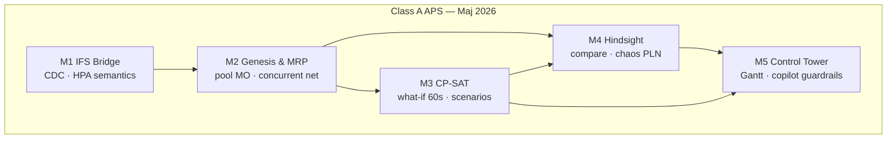

# Master Plan — Production Planning & Year Hindsight (100 kroków · 5 modułów)

**Wersja:** 2.0 · **Market parity:** Maj 2026 (Class A APS)  
**Kontekst:** Oracle **IFS9** = logika i prawda operacyjna · **Open Mercato** = concurrent planning, geneza, CP-SAT, hindsight, control tower  
**Blueprint rynku:** [market-parity-may-2026.md](./2026-05-24-production-planning-market-parity-may-2026.md)  
**Stan kodu:** moduł `production_planning` + `ortools-scheduler` (CP-SAT, chunking 500, rolling 600+) — PR #10

---

## North Star (maj 2026)

> **Być tam, gdzie Kinaxis / o9 / SAP IBP w operacyjnym planowaniu skończonej mocy** — interaktywne what-if w minutach, concurrent propagation, scenario compare, finite 150 WC — **plus** unikalny **genesis tree + 365d hindsight** (chaos premium w walucie).

| Tier | Znaczenie |
|------|-----------|
| **P0** | Must-have parity — bez tego nie wchodzimy w pilot |
| **P1** | Pełna parity UX/ops z Opcenter / Asprova / IBP PP/DS |
| **P2** | Differentiator (genesis, roczny replay, później GPU/agents) |

---

## Cel programu

1. **Operacyjnie (P0):** skończone moce 150 gniazd, OTIF klienta (+3 dni), pool MO, alt routing, **what-if &lt;60 s**, wyjątki w control tower.  
2. **Concurrent (P0):** zmiana zlecenia → delta replan → nowy harmonogram **&lt;15 min** (nie „plan na wczoraj”).  
3. **Analitycznie (P2 differentiator):** 365 dni sprzedaży → genesis → plan referencyjny vs IFS → **chaos premium** (= ile kosztuje brak concurrent planning).  
4. **Technicznie (P0):** CP-SAT bez zawieszania — netting, peg-aware chunk, rolling, scenario snapshots, warm-start.

---

## Pięć modułów

| Moduł | Kroki | Parity (maj 2026) | Szczegóły |
|-------|-------|-------------------|-----------|
| **M1** IFS9 Data Bridge | 1–20 | SAP IBP RTI, o9 ingestion, actuals | [module-1](./2026-05-24-production-planning-module-1-ifs-bridge.md) |
| **M2** Genesis & Netting | 21–40 | IBP OBP, Kinaxis propagation, CBP-lite | [module-2](./2026-05-24-production-planning-module-2-genesis-netting.md) |
| **M3** CP-SAT Engine | 41–60 | PP/DS finite, Opcenter setup, &lt;60s what-if | [module-3](./2026-05-24-production-planning-module-3-cpsat-scale-master-plan.md) |
| **M4** Hindsight Replay | 61–80 | Kinaxis compare, Asprova long sim | [module-4](../plans/master-plan-module-4-year-hindsight-replay-performance-analytics-steps-61-80.md) |
| **M5** UI & Gov | 81–100 | o9 control tower, Maestro agents HITL | [module-5](../plans/master-plan-module-5-mercato-ui-governance-industrialization-steps-81-100.md) |

---

## Fazy wdrożenia (bramki v2.0)

| Faza | Kroki | Bramka market |
|------|-------|---------------|
| **F0** Fundament | 1–20 | Incremental &lt;15 min; reconcile ±0.1%; harmonized planning keys |
| **F1** MRP | 21–40 | 1000+ SO/mies.; pool MO; delta replan &lt;15 min |
| **F2** Solver | 41–60 | What-if p95 **&lt;60 s**; scenario snapshot; 150 WC benchmark |
| **F3** Hindsight | 61–80 | Roczny run; 3 soczewki; chaos premium w PLN |
| **F4** Produkcja | 81–100 | Control tower; copilot propose-only; pilot 2 tyg. |

**Równoległość:** po F0 → F2 na fixture; F3 po F1+F2; M5-82 (exceptions) można zacząć po F1.

---

## KPI sukcesu (Class A, maj 2026)

| KPI | Cel |
|-----|-----|
| Interactive what-if | p95 **&lt;60 s** (7d, ≤500 ops) |
| Full replan pipeline | p95 **&lt;15 min** (1000 SO/mies.) |
| OTIF@+3d | Pułag perfect + **delta vs IFS actual** |
| Chaos premium | **PLN/EUR + %** sprzedaży w waterfall |
| CP-SAT chunk | ≤500 ops; rolling ≥600 |
| Genesis coverage | 100% demand lines |
| Scenario compare | ≥2 plany side-by-side |
| Plan attainment | ≥90% ops ±1 shift (pilot) |
| Anti-fantasy | 0 critical AF-01..05 |

---

## 100 kroków — v2.0 (tabela z parity)

> Każdy krok w plikach modułów ma sekcję **Market parity** (Kinaxis / o9 / SAP / Opcenter / Asprova / Oracle).

### Moduł 1 — IFS9 Data Bridge (1–20) · P0 data foundation

| # | Krok | Deliverable (v2.0) | Parity |
|---|------|-------------------|--------|
| 1 | Inwentaryzacja źródeł IFS9 | Data dictionary + **APS gap analysis** | SAP IBP inventory |
| 2 | ADR read-only Mercato↔IFS | Architektura + **RTI-style contract** | o9 / IBP RTI |
| 3 | Polityka okna 365 dni | **Multi-horizon** buckets (d/t/w/m) | IBP HPA |
| 4 | DDL staging bronze | Migracje + **lineage** | Enterprise IBP |
| 5 | Model silver (canonical) | ERD + **`planning_area_id`** | IBP harmonized area |
| 6 | Connector extract | JDBC + **CDC-ready** | Kinaxis always-on |
| 7 | Extract CO/sales 365d | Job + **DQ SLA** | o9 demand |
| 8 | Extract shop orders | Job | IBP OBP orders |
| 9 | Extract operacje | Job | PP/DS operations |
| 10 | Extract SUPPLY_DEMAND | Pegging foundation | Oracle ASCP |
| 11 | Extract kalendarze WC | Capacity + **shifts** | Opcenter calendars |
| 12 | Extract MANUF_OPERATION_FEEDBACK | **Plan attainment** actuals | MES / IBP feedback |
| 13 | Extract BOM + effectivity | Struktury + **alt routing** | SAP CDP |
| 14 | Transform + surrogate keys | ETL + **as-of columns** | Replay-ready |
| 15 | DQ + reconciliation | ±0.1% gates | Enterprise IBP |
| 16 | Orchestracja backfill | Scheduler | — |
| 17 | Read API dla modułu | API + **cache TTL** | Sub-minuta UI |
| 18 | Incremental + late data | **&lt;15 min freshness** | RTI / concurrent |
| 19 | UAT planistów | Sign-off | — |
| 20 | Runbook + monitoring | Ops + **data SLA dashboard** | Control tower data |

### Moduł 2 — Genesis Trees & Netting (21–40) · P0 MRP + P2 genesis

| # | Krok | Deliverable (v2.0) | Parity |
|---|------|-------------------|--------|
| 21 | Resolver wariantów | `resolve-variant-tree` + **CBP-lite attrs** | SAP CBP |
| 22 | Eksplozja BOM 6 poziomów | `explode.ts` | IBP explosion |
| 23 | Materializacja genesis_roots | Per demand line (**P2**) | Differentiator |
| 24 | Graf genesis_nodes | Drzewo (**P2**) | o9 EKG-lite |
| 25 | Time-bucket gross req | Multi-horizon buckets | IBP HPA |
| 26 | Snapshot podaży | On-hand, WIP, **pegged** | Concurrent net |
| 27 | Net requirements | Lot sizing | IBP / Kinaxis |
| 28 | Reguły pool MO | Konsolidacja SF | **IBP OBP** |
| 29 | Generator MO | Discrete + **pool** | OBP planned orders |
| 30 | Pegging many-to-one | `pegging_links` | SUPPLY_DEMAND |
| 31 | mo_provenance audit | Append-only | Compliance |
| 32 | Incremental replan | **Delta roots &lt;15 min** | Kinaxis concurrent |
| 33 | Worker mrp-netting-run | API + **exception emit** | Always-on |
| 34 | UI genesis explorer | Strona (**P2**) | Compare trees |
| 35 | Zakładka pegging na SO | Injection | Oracle peg inquiry |
| 36 | Pool MO workbench | Release/split | IBP OBP UI |
| 37 | Performance 1000+ SO/mies. | Load test | Scale proof |
| 38 | Alerty + exceptions | **Severity queue** | o9 control tower |
| 39 | Testy golden | CI | — |
| 40 | Cutover M2 | Gate → M3 + **assemblyLinks feed** | Handoff |

### Moduł 3 — CP-SAT Engine (41–60) · P0 finite + interactive

| # | Krok | Deliverable (v2.0) | Parity |
|---|------|-------------------|--------|
| 41 | Benchmark 150 WC / 2500 ops | Harness + **SLO report** | Opcenter 50k scale path |
| 42 | Schema assemblyLinks | Cross-order peg | PP/DS links |
| 43 | Schema changeoverGroups | Sequence setup | Opcenter / Asprova |
| 44 | Schema routingAlternatives | FJSP | SAP CDP |
| 45 | CP-SAT assembly constraints | Python | Peg-aware |
| 46 | Optional intervals (FJSP) | Python | Alt routing |
| 47 | Changeover groups | Python | Matrix setup |
| 48 | Peg-aware chunking | TS | No split peg cluster |
| 49 | Floors + fixed ops + **warm-start** | Batch | Asprova hint |
| 50 | Rolling 600+ @ 150 WC | Python | Large plant |
| 51 | Batch orchestration | Sequential pipeline | — |
| 52 | POST /optimize + **what-if &lt;60s** | API + SLA | Kinaxis interactive |
| 53 | Profilowanie pamięci | Raport | SRE |
| 54 | Tune LARGE + **multi-objective** | tardiness+setup+WIP | o9 trade-offs |
| 55 | Load-test CI gate | **60s p95** enforced | — |
| 56 | Observability | Metrics | — |
| 57 | Failure modes + **plan_scenarios** compare | Versioning + UX errors | Kinaxis compare |
| 58 | E2E Mercato↔Python | Tests | — |
| 59 | Gate M3 | Sign-off | — |
| 60 | Runbook solver | Docs | — |

### Moduł 4 — Year Hindsight (61–80) · P1 compare + P2 chaos ROI

| # | Krok | Deliverable (v2.0) | Parity |
|---|------|-------------------|--------|
| 61 | Encje hindsight_* | Migracje | Scenario store |
| 62 | API runs lifecycle | CRUD | o9 scenario mgmt |
| 63 | Worker orchestrate | Job graph | Batch orchestration |
| 64 | Import 365d | Demand | — |
| 65 | Explode | BOM in run | Asprova long sim |
| 66 | Net (as-of) | Partie | IBP as-of |
| 67 | 52 ticków weekly | Loop | Rolling year |
| 68 | 3 soczewki + **scenario versions** | perfect/as-of/actual | Kinaxis lenses |
| 69 | Granica informacji as-of | Anti-fantasy input | o9 APEX |
| 70 | schedule-window async | CP-SAT | ~8k/rok |
| 71 | Back-pressure | Queue | SRE |
| 72 | Carry-forward | State | — |
| 73 | aggregate-kpis waterfall | Demand→OTIF | IBP waterfall |
| 74 | OTIF +3d | KPI | Industry standard |
| 75 | **Chaos premium (PLN/EUR)** | ROI concurrent | **Unique narrative** |
| 76 | Anti-fantasy AF-01..05 | Validator | Trust |
| 77 | Katalog odrzuceń | Docs | — |
| 78 | Lens IFS actuals | Ground truth | Compare plans |
| 79 | API delta + **plan compare** | Contracts | ASCP compare |
| 80 | Gate M4 → M5 | Sign-off | — |

### Moduł 5 — UI, Governance & Go-Live (81–100) · P0 control tower

| # | Krok | Deliverable (v2.0) | Parity |
|---|------|-------------------|--------|
| 81 | Shell hindsight + nav | Route | o9 workspace |
| 82 | **Control tower** + Overview | Exception queue + KPI | o9 / Kinaxis |
| 83 | Gantt 150 WC virtualized | Tab | Opcenter |
| 84 | Gantt + conflicts + **copilot propose-only** | HITL guardrails | Maestro Agent Studio |
| 85 | Genesis drill-down | Tab | P2 |
| 86 | Heatmap 3D tolerance | Tab | Analytics |
| 87 | **Delta + scenario compare** | Tab | ASCP / Kinaxis |
| 88 | PDF export | Async | — |
| 89 | ACL feature matrix | acl.ts | Enterprise |
| 90 | Scoping WC/site | RLS | Multi-site |
| 91 | CI gates | Pipeline | — |
| 92 | Deploy | K8s/Docker | — |
| 93 | Monitoring bridge | Alerts | — |
| 94 | Monitoring jobs | Dashboard | — |
| 95 | Runbook planisty | Wiki | — |
| 96 | Runbook bridge | Wiki | — |
| 97 | Runbook hindsight + **chaos PLN** | Szkolenie | ROI story |
| 98 | ADR IFS write-back | Governance | IBP RTI write |
| 99 | Pilot write-back | Flag | Controlled |
| 100 | Go-live Class A checklist | Sign-off | **Parity sign-off** |

---

## Porównanie z rynkiem (maj 2026)

| Vendor | Ich mocna strona 2026 | Mercato odpowiedź |
|--------|----------------------|-------------------|
| **Kinaxis Maestro** | Concurrent + GPU scenarios + agents | M2-32, M3-52/57, M5-84 (HITL) |
| **o9 Digital Brain** | EKG + IBP + control tower | M2-24/38, M5-82, M1-5 |
| **SAP IBP HPA** | Harmonized area + OBP + PP/DS | M1-5, M2-28/29, M3 finite |
| **Opcenter APS 2510** | Gantt + setup + 50k ops path | M3-47, M5-83/84 |
| **Asprova 18** | Sub-min reschedule + KPI eval | M3-52/54, M4-73 |
| **Oracle ASCP** | Pegging + compare plans | M1-10, M4-79, M5-87 |
| **Mercato unique** | Genesis + 365d chaos premium | M2-23/24, M4-75 ★ |

---

## Ryzyka (v2.0)

| Ryzyko | Mitigacja |
|--------|-----------|
| „120s solve” za wolno na rynek | KPI **60s** + warm-start (49, 54) |
| Brak scenario compare | 57, 68, 87 |
| Planista nie ufa AI | Copilot **propose-only** (84), AF (76) |
| GPU FOMO | P2 — najpierw CPU peg-aware (blueprint) |
| Chaos premium = akademia | **PLN/EUR** (75, 97) |

---

## Następna akcja

1. **PO:** zatwierdzić [market-parity-may-2026.md](./2026-05-24-production-planning-market-parity-may-2026.md) jako kontrakt parity.  
2. **Równolegle:** M1-5/18 (CDC) + M3-57 (scenarios) + M3-52 (60s SLA).  
3. **90 dni:** sekcja „Implementacja priorytetowa” w blueprint.  
4. **Metryka sukcesu pilota:** planista wybiera Mercato zamiast Excela do what-if w shift.

---

*v2.0 — podniesienie z hasłowego checklistu do Class A APS parity (maj 2026); moduły 1–5 z sekcją Market parity per krok.*
