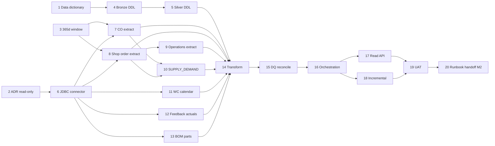

# Production Planning Master Plan — Module 1: IFS9 Data Bridge

**Scope:** Steps **1–20** · **Open Mercato** `production_planning` + **IFS9 read-only extract**  
**Prerequisite:** None — Module 1 is the program entry point. Mercato `production_planning` foundation entities (orders, operations, capacity) may exist as stubs; IFS is not required at CP-SAT runtime.  
**System of record:** Oracle **IFS9** (Applications) — Mercato reads only; no write-back in Module 1.

**Scale targets for this module**

| Dimension | Target |
|-----------|--------|
| Historical window | **365 calendar days** of demand, supply, and actuals (year hindsight prerequisite) |
| Customer orders | ≥10,000 `CUSTOMER_ORDER` / `CUSTOMER_ORDER_LINE` rows in window |
| Shop orders | ≥5,000 `SHOP_ORDER` + ≥25,000 `SHOP_ORDER_OPERATION` rows |
| Supply/demand pegs | ≥50,000 `SUPPLY_DEMAND` rows with resolvable supply/demand keys |
| Work centers | 150 `WORK_CENTER` records + calendar coverage for full window |
| BOM structures | ≥2,000 active `MANUF_STRUCTURE` / `MANUF_STRUCTURE_ALTERNATIVE` effectivity rows |
| Initial backfill | Full 365d load completes in ≤4 h on staging (parallel extract jobs) |
| Incremental sync | ≤15 min lag p95 from IFS change to silver availability |
| Reconciliation | ±0.1% row-count variance vs IFS control queries on CO/SO headers |

**Owners key**

| Owner | Responsibility |
|-------|----------------|
| **Integration / Data** | IFS9 inventory, JDBC extracts, bronze/silver ETL, reconciliation |
| **Mercato Backend** | Staging migrations, read API, module wiring under `apps/mercato/.../production_planning` |
| **DevOps / SRE** | Secrets, scheduler, observability, capacity, runbooks |
| **Planner SME** | 365d window rules, UAT sign-off, peg semantics validation |
| **QA** | Fixture datasets, reconciliation gates, API contract tests |

**Theme map (steps → concern)**

| Theme | Steps | Primary IFS9 objects |
|-------|-------|----------------------|
| Discovery & governance | 1–3 | All listed tables + site/contract context |
| Staging DDL | 4–5 | Bronze raw + silver canonical |
| Extract infrastructure | 6 | JDBC / read-only service account |
| Demand & sales extract | 7 | `CUSTOMER_ORDER`, `CUSTOMER_ORDER_LINE`, `CUSTOMER_INFO` |
| Manufacturing orders | 8–9 | `SHOP_ORDER`, `SHOP_ORDER_OPERATION`, `OPERATION` |
| Pegging & supply | 10 | `SUPPLY_DEMAND`, `INVENTORY_PART`, `PURCHASE_ORDER_LINE` |
| Capacity & calendars | 11 | `WORK_CENTER`, `WORK_CENTER_CALENDAR`, `WORK_CENTER_GROUP` |
| Actuals & feedback | 12 | `MANUF_OPERATION_FEEDBACK`, `SHOP_ORD_OPERATION_HISTORY` |
| BOM & parts master | 13 | `MANUF_STRUCTURE`, `MANUF_STRUCTURE_ALTERNATIVE`, `INVENTORY_PART`, `PART_CATALOG` |
| Transform & identity | 14 | Surrogate keys, natural keys `(contract, order_no, line_no, …)` |
| Quality & reconcile | 15 | Control totals vs IFS SQL |
| Orchestration | 16 | Backfill + cron incremental |
| Consumption API | 17 | Mercato `production_planning` read endpoints |
| Incremental & late data | 18 | Watermarks on `ROWVERSION` / `LAST_ACTIVITY_DATE` |
| UAT & release | 19–20 | Planner sign-off, runbooks, Module 2 handoff |

**Handoff to Module 2 (Genesis & Netting, steps 21–40)**

Module 2 consumes silver tables and read APIs delivered here:

| Module 1 output | Module 2 consumer |
|---------------|-----------------|
| `ifs_silver_customer_order_lines` (365d demand) | Genesis roots per demand line (step 23) |
| `ifs_silver_supply_demand` peg graph | Many-to-one pegging links (step 30) |
| `ifs_silver_manuf_structure*` + effectivity | BOM explosion 6 levels (step 22) |
| `ifs_silver_inventory_part` on-hand snapshots | Gross/net requirements (steps 25–27) |
| `ifs_silver_shop_orders` WIP supply | Pool MO rules & netting (steps 28–29) |
| Read API `/api/production_planning/ifs/*` | MRP workers without direct JDBC |

Module 1 must **not** implement genesis trees, MRP netting, or CP-SAT payloads — only faithful, reconciled IFS read replicas in Mercato Postgres.

---

## Step 1 — IFS9 source inventory & data dictionary

**Deliverable:** Versioned data dictionary (`docs/integrations/ifs9/data-dictionary.md`) listing every IFS9 table/view used by production planning, column mappings, primary keys, change-detection columns, and sample row counts from production-like schema.

**Owner:** Integration / Data

**Acceptance criteria:**
- Dictionary covers at minimum: `CUSTOMER_ORDER`, `CUSTOMER_ORDER_LINE`, `CUSTOMER_ORDER_CHARGE`, `SHOP_ORDER`, `SHOP_ORDER_OPERATION`, `SUPPLY_DEMAND`, `WORK_CENTER`, `WORK_CENTER_CALENDAR`, `WORK_CENTER_GROUP`, `MANUF_OPERATION_FEEDBACK`, `MANUF_STRUCTURE`, `MANUF_STRUCTURE_ALTERNATIVE`, `MANUF_STRUCTURE_HEAD`, `INVENTORY_PART`, `INVENTORY_PART_IN_STOCK`, `PART_CATALOG`, `OPERATION`, `OPERATION_HISTORY`, `SITE`, `CONTRACT`.
- Each entry documents IFS `CONTRACT` / site scoping, nullable fields, and enums (`OBJSTATE`, `ORDER_CODE`, `DEMAND_CODE`, `SUPPLY_CODE`).
- Row-count baseline captured for 365d window filter (Step 3) on staging IFS clone.
- Glossary defines peg types (`DEMAND_CODE` / `SUPPLY_CODE`) and shop-order vs customer-order linkage fields.
- Dictionary stored in repo; SME review comments resolved before Step 4 DDL freeze.

---

## Step 2 — ADR: Read-only Mercato ↔ IFS9 integration architecture

**Deliverable:** Architecture Decision Record (`docs/adr/ADR-PP-001-ifs9-read-only-bridge.md`) defining network path, credentials, failure modes, and explicit **no write-back** boundary for Module 1.

**Owner:** Integration / Data + DevOps / SRE

**Acceptance criteria:**
- ADR selects **JDBC read-only** extract to Mercato Postgres (bronze → silver); rejects bi-directional API for Module 1.
- Documents connection pattern: dedicated IFS DB read replica or `IFSAPP` read-only user; TLS; IP allowlist; secret rotation via vault.
- Defines idempotency: extracts are **append/upsert by natural key**, never mutate IFS.
- States Mercato CP-SAT / optimize path **must not call IFS at runtime** (F0 gate from master plan).
- Security review sign-off recorded; PII fields (customer name on `CUSTOMER_ORDER`) flagged for redaction in non-prod.

---

## Step 3 — 365-day window policy & date anchor rules

**Deliverable:** Window specification (`docs/integrations/ifs9/window-policy.md`) with SQL filter templates per entity class and planner-approved anchor date for hindsight runs.

**Owner:** Planner SME + Integration / Data

**Acceptance criteria:**
- **Demand side:** `CUSTOMER_ORDER` / `CUSTOMER_ORDER_LINE` included when `WANTED_DELIVERY_DATE` OR `PLANNED_DELIVERY_DATE` OR `DATE_ENTERED` intersects `[anchor − 365d, anchor)`.
- **Supply side:** `SHOP_ORDER` included when `REVISED_START_DATE`, `REVISED_DUE_DATE`, or `EARLIEST_START_DATE` intersects window; released and closed orders retained for actuals.
- **Pegging:** `SUPPLY_DEMAND` included when either linked demand or supply header falls in window (closure rule documented).
- **Actuals:** `MANUF_OPERATION_FEEDBACK` included for `FEEDBACK_TIME` in window regardless of order entry date.
- **BOM effectivity:** `MANUF_STRUCTURE` / `MANUF_STRUCTURE_ALTERNATIVE` rows effective at any date in window (not only current effectivity).
- Anchor date configurable via env `IFS_EXTRACT_ANCHOR_DATE` (default: org local midnight yesterday); documented for Module 4 replay alignment.

---

## Step 4 — Bronze staging DDL (raw IFS landing)

**Deliverable:** MikroORM migration(s) under `apps/mercato/src/modules/production_planning/migrations/` creating `ifs_bronze_*` tables — verbatim-ish IFS columns plus ingest metadata.

**Owner:** Integration / Data + Mercato Backend

**Acceptance criteria:**
- One bronze table per extract entity (e.g. `ifs_bronze_customer_order`, `ifs_bronze_customer_order_line`, `ifs_bronze_shop_order`, `ifs_bronze_shop_order_operation`, `ifs_bronze_supply_demand`, `ifs_bronze_work_center`, `ifs_bronze_work_center_calendar`, `ifs_bronze_manuf_operation_feedback`, `ifs_bronze_manuf_structure`, `ifs_bronze_manuf_structure_alternative`, `ifs_bronze_inventory_part`).
- Common ingest columns on every bronze table: `id` (UUID PK), `tenant_id`, `organization_id`, `extract_batch_id`, `extracted_at`, `source_row_hash`, `raw_payload_json` (optional full-row JSONB for drift debugging).
- Natural key columns preserved (`contract`, `order_no`, `line_no`, `release_no`, `sequence_no`, `part_no`, etc.) with **non-unique** indexes for load performance.
- No FK from bronze to silver (load order flexibility); migration runs clean on empty DB.
- Table/column naming convention documented in migration header comment.

---

## Step 5 — Silver canonical model DDL (production-planning consumption)

**Deliverable:** Silver ERD + migrations for `ifs_silver_*` tables normalized for Mercato consumption and Module 2 genesis/MRP.

**Owner:** Mercato Backend + Integration / Data

**Acceptance criteria:**
- Silver entities defined:
  - `ifs_silver_customer_orders` / `ifs_silver_customer_order_lines`
  - `ifs_silver_shop_orders` / `ifs_silver_shop_order_operations`
  - `ifs_silver_supply_demand_pegs`
  - `ifs_silver_work_centers` / `ifs_silver_work_center_calendar_slots`
  - `ifs_silver_manuf_operation_feedback`
  - `ifs_silver_manuf_structures` / `ifs_silver_manuf_structure_alternatives`
  - `ifs_silver_inventory_parts` / `ifs_silver_inventory_on_hand` (snapshot)
  - `ifs_silver_extract_watermarks` (entity-level cursor state)
- Unique constraints on IFS natural keys per `(tenant_id, organization_id, contract, …)`.
- Typed columns: timestamps TZ-aware, `numeric` for quantities, text enums mapped from IFS states.
- `is_deleted` / `last_seen_at` columns support incremental soft-delete detection.
- ERD diagram checked into `docs/integrations/ifs9/silver-erd.mmd`.

---

## Step 6 — JDBC connector & secure extract runtime

**Deliverable:** `services/ifs9-extract/` (or `apps/mercato/src/modules/production_planning/lib/ifs9/`) JDBC connector with pooled connections, parameterized queries, and batch streaming.

**Owner:** Integration / Data + DevOps / SRE

**Acceptance criteria:**
- Oracle JDBC driver (ojdbc11+) with read-only connection validation query (`SELECT 1 FROM DUAL`).
- Config via env: `IFS_JDBC_URL`, `IFS_JDBC_USER`, `IFS_JDBC_PASSWORD`, `IFS_JDBC_FETCH_SIZE` (default 2000), `IFS_CONTRACTS` (comma-separated filter).
- Streaming fetch — never loads full 365d result set into memory; writes bronze in batches of ≤5,000 rows.
- Connection errors classified: retryable (network, timeout) vs fatal (auth, syntax); exponential backoff with max 3 retries per batch.
- Extract emits structured logs: `entity`, `batchId`, `rowCount`, `durationMs`, `watermark`.
- Unit tests with Testcontainers Oracle or mocked `ResultSet`; no credentials in repo.

---

## Step 7 — Extract job: `CUSTOMER_ORDER` & `CUSTOMER_ORDER_LINE` (365d)

**Deliverable:** Scheduled extract job `extract-customer-orders.ts` pulling demand headers and lines into bronze, driven by Step 3 window policy.

**Owner:** Integration / Data

**Acceptance criteria:**
- SQL source tables: `CUSTOMER_ORDER`, `CUSTOMER_ORDER_LINE`; joins on `(contract, order_no)`; optional `CUSTOMER_INFO` for priority tier.
- Captures fields required for hindsight demand: `catalog_no` / `part_no`, `buy_qty_due`, `wanted_delivery_date`, `planned_delivery_date`, `objstate`, `chance_of_success`, `customer_no`.
- Line filter excludes cancelled lines per planner rule (`objstate` / `rowstate` documented).
- Job idempotent: re-run with same batch replaces bronze rows by natural key + batch id without duplicates.
- Staging validation: row count within ±0.1% of IFS control query supplied by Integration team.
- Job registered in scheduler with name `ifs9.extract.customer_orders`.

---

## Step 8 — Extract job: `SHOP_ORDER` (365d)

**Deliverable:** Extract job `extract-shop-orders.ts` for manufacturing supply orders linked to parts and optionally customer demand.

**Owner:** Integration / Data

**Acceptance criteria:**
- Source: `SHOP_ORDER` with window on revised/earliest dates (Step 3).
- Captures: `order_no`, `part_no`, `contract`, `revised_qty_due`, `revised_start_date`, `revised_due_date`, `objstate`, `priority`, `note_id`, `demand_code` / customer order reference when populated.
- Includes pool/repetitive markers if present (`order_code`, `schedule_no`) for Module 2 pool MO rules.
- Links to `CUSTOMER_ORDER` captured when IFS populates demand peg fields on shop order header.
- Bronze load completes for full window without OOM; documented row/sec on staging hardware.

---

## Step 9 — Extract job: `SHOP_ORDER_OPERATION` & routings (365d)

**Deliverable:** Extract job `extract-shop-order-operations.ts` for operation-level scheduling data.

**Owner:** Integration / Data

**Acceptance criteria:**
- Source: `SHOP_ORDER_OPERATION` joined to `OPERATION` / `WORK_CENTER` for standard op metadata.
- Captures per operation: `operation_no`, `work_center_no`, `mach_run_factor`, `labor_run_factor`, `run_time`, `setup_time`, `move_time`, `op_start_date`, `op_finish_date`, `objstate`, `qty_complete`, `revised_qty_due`.
- Multi-pass routing: all operations for shop orders selected in Step 8 (order closure, not independent date filter).
- Supports alternate routing reference via `operation_no` / `alternative_no` when IFS models alternates at operation level.
- Data supports CP-SAT payload building in Module 3 (durations, WC codes) without re-querying IFS.

---

## Step 10 — Extract job: `SUPPLY_DEMAND` pegging graph (365d)

**Deliverable:** Extract job `extract-supply-demand.ts` building bronze peg rows and silver peg graph for demand ↔ supply linkage.

**Owner:** Integration / Data

**Acceptance criteria:**
- Source: `SUPPLY_DEMAND` with `demand_code`, `supply_code`, `demand_order_no`, `supply_order_no`, `demand_release`, `supply_release`, `demand_sequence`, `supply_sequence`, `qty_pegged`, `contract`.
- Closure rule: include peg if **either** demand (`CUSTOMER_ORDER_LINE`, `SHOP_ORDER`, forecast, etc.) or supply side shop order is in Step 8/7 sets OR peg qty &gt; 0 with activity in window.
- Peg types mapped to enum: `customer_line`, `shop_order`, `purchase_order`, `on_hand`, `forecast` based on IFS `demand_code` / `supply_code` values (full value list in data dictionary).
- Silver table `ifs_silver_supply_demand_pegs` stores resolved UUID FKs to silver demand/supply entities where resolvable; `unresolved_ref_json` for orphan pegs.
- QA fixture validates many-to-one peg chains (multiple CO lines → one shop order) match planner Excel sample.

---

## Step 11 — Extract job: `WORK_CENTER` & `WORK_CENTER_CALENDAR`

**Deliverable:** Extract jobs for capacity master data and calendar slots covering the 365d window (plus forward buffer for planning horizon).

**Owner:** Integration / Data

**Acceptance criteria:**
- Sources: `WORK_CENTER`, `WORK_CENTER_GROUP`, `WORK_CENTER_CALENDAR` (and `WORK_TIME_CALENDAR` / `CAPACITY_CALENDAR` if used by site).
- Captures WC: `work_center_no`, `description`, `department`, `capacity`, `calendar_id`, `valid_from`, `site`, efficiency factors.
- Calendar: expanded to **slot rows** in silver (`ifs_silver_work_center_calendar_slots`) with `start_at`, `end_at`, `capacity_units`, `is_working`.
- Coverage: every WC referenced by Step 9 operations has calendar coverage for ≥95% of working days in window (gaps flagged in DQ report).
- Target scale: 150 work centers supported; extract handles up to 200.
- Aligns with existing Mercato `capacity-snapshot.ts` field names (`workCenterCode`, slot boundaries).

---

## Step 12 — Extract job: `MANUF_OPERATION_FEEDBACK` (actuals)

**Deliverable:** Extract job `extract-manuf-operation-feedback.ts` for realized operation timings and quantities (hindsight **IFS actuals** lens input).

**Owner:** Integration / Data

**Acceptance criteria:**
- Source: `MANUF_OPERATION_FEEDBACK` joined to `SHOP_ORDER_OPERATION` for keys; optional `SHOP_ORD_OPERATION_HISTORY` for corrections.
- Captures: `feedback_id`, `order_no`, `operation_no`, `work_center_no`, `employee_id` (optional/redacted), `feedback_time`, `qty_good`, `qty_scrap`, `setup_time`, `run_time`, `actual_start`, `actual_finish`.
- Window filter on `FEEDBACK_TIME` per Step 3; includes feedback for shop orders outside demand window if feedback date in window.
- Silver rows linked to `ifs_silver_shop_order_operations` when possible; orphan actuals retained with natural key for Module 4 reconciliation.
- Supports year hindsight KPI: planned vs actual operation finish variance.

---

## Step 13 — Extract job: BOM & parts (`MANUF_STRUCTURE`, alternatives, `INVENTORY_PART`)

**Deliverable:** Extract jobs for manufacturing structures and inventory part master supporting Module 2 explosion.

**Owner:** Integration / Data

**Acceptance criteria:**
- Sources: `MANUF_STRUCTURE`, `MANUF_STRUCTURE_HEAD`, `MANUF_STRUCTURE_ALTERNATIVE`, `INVENTORY_PART`, `PART_CATALOG`, optional `INVENTORY_PART_IN_STOCK` snapshot.
- Structure extract includes: `part_no`, `component_part`, `qty_per_assembly`, `line_item_no`, `issue_type`, `shrinkage_factor`, `effective_date`, `obsolete_date`, `alternative_no`, `operation_no`.
- Alternatives: `MANUF_STRUCTURE_ALTERNATIVE` maps priority / selection rules for variant resolution (Module 2 step 21).
- `INVENTORY_PART` captures: `part_no`, `description`, `unit_meas`, `lead_time_code`, `planning_method`, `type_code` (manufactured/purchased/raw).
- On-hand snapshot: qty by `contract` / `location` at extract time stored in `ifs_silver_inventory_on_hand` with `snapshot_at`.
- Effectivity rule: include structures effective for any day in 365d window (Step 3).

---

## Step 14 — Bronze → silver transform & surrogate key registry

**Deliverable:** ETL transform layer `lib/ifs9/transform/` mapping bronze batches to silver upserts with stable Mercato surrogate IDs and cross-reference table.

**Owner:** Mercato Backend + Integration / Data

**Acceptance criteria:**
- Transform runs per entity after bronze batch commit; transactional per batch.
- Registry table `ifs_silver_natural_key_map` stores `(entity_type, contract, natural_key_hash) → silver_id` for idempotent upserts.
- Surrogate UUIDs stable across re-extracts (lookup before insert).
- Type coercion and enum normalization centralized (IFS `Objstate` → Mercato enum).
- `source_row_hash` change detection skips no-op updates.
- Transform unit tests cover: new insert, update, soft-delete, resurrected row.

---

## Step 15 — Data quality rules & reconciliation reports

**Deliverable:** DQ suite `lib/ifs9/dq/` + nightly reconciliation report (`ifs9-reconcile-report.json` / admin HTML).

**Owner:** Integration / Data + QA

**Acceptance criteria:**
- **Reconciliation checks** (IFS control SQL vs silver counts):
  - `CUSTOMER_ORDER` headers in window ±0.1%
  - `CUSTOMER_ORDER_LINE` active lines ±0.1%
  - `SHOP_ORDER` in window ±0.1%
  - `SHOP_ORDER_OPERATION` for extracted shop orders ±0.05%
  - `SUPPLY_DEMAND` peg row count ±0.5% (higher tolerance due to closure rules)
- **Referential checks:** every `SHOP_ORDER_OPERATION.work_center_no` exists in silver WC; ≥98% peg demand/supply refs resolve.
- **Freshness:** `max(last_updated_at)` per entity &lt; 24h after scheduled incremental.
- Failures emit `IFS_DQ_*` codes; critical failures block silver promotion flag `ifs_silver.promotion_blocked`.
- Report archived per extract batch for audit trail.

---

## Step 16 — Backfill orchestration & scheduler integration

**Deliverable:** Orchestrator `workers/ifs9-backfill.ts` + cron incremental coordinator registering all Step 7–13 jobs with dependency order.

**Owner:** DevOps / SRE + Mercato Backend

**Acceptance criteria:**
- Backfill graph executes in order: parts/BOM → work centers/calendars → customer orders → shop orders → operations → supply_demand → feedback → transform → DQ.
- Full 365d backfill completes in ≤4 h on staging (parallelism configurable `IFS_EXTRACT_PARALLELISM`, default 4).
- Uses Mercato `queue` / `scheduler` patterns (see `capacity-refresh.ts` worker); job progress persisted for admin visibility.
- Partial failure: resume from last successful entity job without re-extracting completed entities.
- Manual trigger: `POST /api/production_planning/ifs/sync` (admin ACL) enqueues backfill or incremental mode.
- Initial production runbook dry-run executed once in staging with signed timing log.

---

## Step 17 — Read API for `production_planning` module

**Deliverable:** Read-only REST routes under `apps/mercato/src/modules/production_planning/api/ifs/` exposing silver data to module code without JDBC.

**Owner:** Mercato Backend

**Acceptance criteria:**
- Endpoints (minimum):
  - `GET /api/production_planning/ifs/customer-order-lines?from=&to=&contract=`
  - `GET /api/production_planning/ifs/shop-orders/:orderNo/operations`
  - `GET /api/production_planning/ifs/supply-demand/pegs?demandRef=&supplyRef=`
  - `GET /api/production_planning/ifs/work-centers` + `/calendar?from=&to=`
  - `GET /api/production_planning/ifs/manuf-structures/:partNo?effectiveDate=`
  - `GET /api/production_planning/ifs/operation-feedback?from=&to=`
  - `GET /api/production_planning/ifs/sync/status`
- Tenant + organization scoping on all queries; ACL feature `production_planning.ifs.read`.
- Pagination cursor-based; default page size 500; max 5,000.
- OpenAPI fragments checked into module; contract tests in `lib/__tests__/ifs-api.test.ts`.
- **No runtime IFS JDBC** from API handlers — Postgres silver only (F0 gate).

---

## Step 18 — Incremental sync, watermark & late-arriving data

**Deliverable:** Incremental extract strategy using per-entity watermarks (`ifs_silver_extract_watermarks`) with late-data handling policy.

**Owner:** Integration / Data + Mercato Backend

**Acceptance criteria:**
- Watermark column priority documented per entity: `LAST_ACTIVITY_DATE`, `ROWVERSION`, `OBJVERSION`, or composite `(last_updated, order_no)`.
- Incremental job schedule: every 15 min (configurable `IFS_INCREMENTAL_CRON`); nightly full reconciliation sample (1% stratified row compare).
- **Late-arriving rows:** if `DATE_ENTERED` falls inside window but row created after initial backfill, incremental captures and silver upserts; peg closure job re-runs for affected `SUPPLY_DEMAND` keys.
- **Deletes:** IFS row absent from incremental key set for N runs → soft-delete in silver (`is_deleted=true`); N default 3.
- Watermark lag metric exported: p95 ≤15 min behind IFS `LAST_ACTIVITY_DATE` on pilot tables.
- Schema drift: extract column mismatch fails job with actionable `IFS_SCHEMA_DRIFT` error listing missing columns.

---

## Step 19 — Planner UAT & Module 1 acceptance sign-off

**Deliverable:** UAT script + signed acceptance checklist comparing Mercato silver exports to planner reference extracts (Excel/SQL).

**Owner:** Planner SME + QA

**Acceptance criteria:**
- UAT covers: 50 sample customer order lines with pegs to shop orders; 20 shop orders with full routing; 10 BOM explosions manually verified against IFS UI; WC calendar spot-check for 2 weeks.
- Planners confirm 365d window matches business definition of "year hindsight sales load."
- Peg graph sample: ≥95% match planner manual peg trace on UAT set.
- Sign-off document stored in `docs/integrations/ifs9/uat-module1-signoff.pdf` (or markdown with approver names/dates).
- Critical defects = 0; major defects have waiver or fix before Step 20 production runbook.

---

## Step 20 — Monitoring, production runbook & Module 2 handoff

**Deliverable:** Production runbook (`docs/production-planning/ifs9-bridge-runbook.md`), monitoring dashboards/alerts, Module 1 release checklist, and explicit handoff package for Module 2.

**Owner:** DevOps / SRE + Integration / Data

**Acceptance criteria:**
- Runbook sections: architecture diagram, env vars, backfill procedure, incremental recovery, credential rotation, `IFS_DQ_*` / `IFS_SCHEMA_DRIFT` troubleshooting, reconciliation failure escalation.
- Alerts: extract job failure, watermark lag &gt; 30 min, DQ promotion blocked, JDBC connection pool exhaustion.
- Metrics: rows extracted/min, transform latency, silver table row counts, reconcile variance %.
- Release checklist verified in staging: backfill → incremental → API smoke → DQ green → rollback drill.
- **Module 2 handoff package** includes:
  - Silver ERD + natural key map schema
  - Read API OpenAPI export
  - Sample peg graph dataset for genesis tests
  - List of known unresolved pegs / data gaps with severity
  - Recommended Module 2 step 21 entry criteria (F0 gate: "Import IFS 365d reconciled")
- Update `apps/mercato/src/modules/production_planning/AGENTS.md` with IFS bridge env vars and read API paths.

---

## Module 1 dependency graph (summary)

---

## Module 1 → Module 2 handoff checklist

| # | Criterion | Owner |
|---|-----------|-------|
| 1 | 365d silver populated for pilot org | Integration / Data |
| 2 | DQ reconcile ±0.1% on CO/SO headers | QA |
| 3 | Peg graph available via API and silver | Mercato Backend |
| 4 | BOM + alternatives effective-dated in silver | Integration / Data |
| 5 | WC calendars ≥95% coverage | Planner SME |
| 6 | Incremental sync operational ≥72h soak | DevOps / SRE |
| 7 | UAT sign-off (Step 19) | Planner SME |
| 8 | Runbook published (Step 20) | DevOps / SRE |

**Module 2 may start step 21** when all rows above are checked. Module 3 CP-SAT scale work may proceed in parallel on synthetic fixtures without waiting for Module 1 (per master plan F0/F2 parallelism).

---

## References

- `.ai/specs/2026-05-24-production-planning-master-plan.md`
- `.ai/specs/2026-05-24-production-planning-module-2-genesis-netting.md` (consumer)
- `.ai/specs/2026-05-24-production-planning-module-3-cpsat-scale-master-plan.md`
- `apps/mercato/src/modules/production_planning/AGENTS.md`
- Oracle IFS Applications 9 — Manufacturing / Customer Order / Inventory data model documentation (site-specific)
