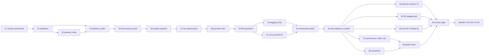

# Production Planning Master Plan — Module 2: Genesis Trees & MRP Netting

**Scope:** Steps **21–40** · **Open Mercato** `production_planning` module (`apps/mercato/src/modules/production_planning/`)  
**Prerequisite:** Module 1 complete (steps 1–20): IFS9 bronze/silver staging, BOM + effectivity extract, sales/shop-order read API, 365-day reconciliation gate (F0).

**Business outcome:** Every sales-order demand line gets a **genesis tree** (variant routing → 6-level BOM explosion → time-bucketed gross requirements → net requirements → **pool MO** consolidation with many-to-one pegging). Production orders emitted here feed Module 3 CP-SAT scheduling — **not** one MO per demand tree.

---

## Scale targets for this module

| Dimension | Target |
|-----------|--------|
| Sales orders | **1,000+ customer orders/month** per org (burst 80/day) |
| Demand lines | **3,000+ lines/month** after line split (avg 3 lines/SO) |
| Genesis roots | 100% demand lines materialized within netting run |
| BOM depth | **6 levels** max explosion (configurable cap, hard stop at 6) |
| Semi-finished pool MO | Consolidate repeatable SF SKUs into **≤1 pool MO per SKU × time bucket** (not 1 MO per SO tree) |
| Netting run wall time | Full org replan **≤15 min** async; incremental delta **≤3 min** p95 |
| Pegging links | Many demand lines → one pool MO; full provenance retained |
| Genesis nodes per root | p95 ≤120 nodes; p99 ≤250 nodes (6-level BOM + routing) |
| MO proposals per run | Netting reduces discrete MO count **≥60%** vs naive 1-MO-per-tree baseline on golden fixture |

---

## Owners key

| Owner | Responsibility |
|-------|----------------|
| **MRP / Backend** | `lib/mrp/*`, explode/netting logic, pool MO rules, pegging, APIs |
| **Integration / Data** | Supply snapshots from M1 silver (`on_hand`, WIP, open PO/MO); BOM/routing read adapters |
| **Mercato Platform** | Migrations, entities, queue workers, events, observability |
| **Frontend** | Genesis explorer, pegging tab on sales order, pool MO workbench |
| **QA** | Golden fixtures, integration tests, performance gate, cutover sign-off |
| **Product / Planning SME** | Pool MO rules UAT, pegging semantics, F1 gate approval |

---

## Theme map (steps 21–40)

| Steps | Theme |
|-------|-------|
| 21–22 | Variant resolution + 6-level BOM explosion engine |
| 23–24 | Genesis domain model (`genesis_roots`, `genesis_nodes`) & graph persistence |
| 25–27 | Time-bucket gross requirements, supply snapshot, net requirements |
| 28–29 | Pool MO rules + discrete/pool MO proposal generator |
| 30–31 | Pegging (`pegging_links`) + append-only MO provenance audit |
| 32–33 | Incremental replan + `mrp-netting-run` worker & API |
| 34–36 | UI: genesis explorer, SO pegging tab, pool MO workbench |
| 37–38 | Performance at 1,000+ SO/month + exceptions & observability |
| 39–40 | Golden integration tests + Module 2 cutover gate → Module 3 CP-SAT |

---

## Step 21 — Technology variant resolver (`resolve-variant-tree`)

**Deliverable:** `lib/mrp/resolve-variant-tree.ts` — given a demand line `(productSku, qty, requestedDate, customerAttrs?)`, resolve the effective **routing/BOM variant** from M1 silver (`ifs_bom_headers`, `ifs_routing_alternatives`, effectivity windows). Output: `VariantTreeResolution` with `rootSku`, `variantCode`, `bomRevisionId`, `routingId`, `effectivityAt`, and ordered `routingSteps[]`.

**Owner:** MRP / Backend

**Acceptance criteria:**
- Effectivity date = `min(requestedDate, planningHorizonEnd)` unless org config `useOrderEntryDate`.
- Ambiguous variant (multiple active routings) returns `VARIANT_AMBIGUOUS` with candidate list; no silent pick without `variantPreference` org setting.
- Missing BOM/routing for SKU returns `VARIANT_NO_STRUCTURE` — demand line flagged, netting run continues for other lines.
- Unit tests cover: single variant, date-bound effectivity crossover, superseded revision, and customer-specific routing override (when present in silver).
- Resolver is pure/deterministic: same inputs + same M1 snapshot version → identical output hash.

---

## Step 22 — 6-level BOM explosion engine (`explode.ts`)

**Deliverable:** `lib/mrp/explode.ts` — multi-level BOM explosion from `VariantTreeResolution`, max depth **6**, emitting `ExplodedLine[]` per node: `{ level, parentNodeKey, componentSku, qtyPer, extendedQty, scrapFactor, phantomFlag, makeOrBuy, leadTimeDays }`. Integrates routing steps at make nodes.

**Owner:** MRP / Backend

**Acceptance criteria:**
- Depth >6 truncates with `EXPLODE_MAX_DEPTH` warning on root; no infinite loop on cyclic BOM (cycle detection via visited `(sku, bomRevisionId)` set).
- Phantom assemblies (`phantomFlag`) roll through without creating make nodes; quantities multiply correctly through phantoms.
- Scrap factor applied per component line: `extendedQty = parentQty × qtyPer × (1 + scrapFactor)`.
- `makeOrBuy = buy` leaves leaf purchase demand; `make` attaches routing operations template for downstream MO generation.
- Golden fixture: 4-level real BOM + 1 phantom level → expected node count and quantities match within ±0.0001 UoM.
- Explosion completes ≤50ms p95 per demand line on golden SKU (profiled in Step 37).

---

## Step 23 — Entity & migration: `production_planning_genesis_roots`

**Deliverable:** MikroORM entity + migration `Migration20260525*_production_planning_genesis_roots.ts`:

| Column | Purpose |
|--------|---------|
| `id` | UUID PK |
| `tenant_id`, `organization_id` | Scope |
| `demand_source_type` | `sales_order_line` \| `forecast` \| `manual` |
| `demand_source_id` | FK to sales line or external ref |
| `sales_order_id` | Nullable FK for SO pegging tab |
| `product_sku`, `quantity`, `due_at` | Demand attributes |
| `variant_code`, `bom_revision_id`, `routing_id` | Resolved variant (Step 21) |
| `status` | `pending` \| `exploded` \| `netted` \| `released` \| `error` |
| `resolution_json` | Full `VariantTreeResolution` |
| `netting_run_id` | Last run that touched this root |
| `content_hash` | Idempotency / incremental skip |
| `error_code`, `error_message` | Last failure |

Indexes: `(tenant_id, organization_id, sales_order_id)`, `(netting_run_id)`, `(status, due_at)`.

**Owner:** Mercato Platform + MRP / Backend

**Acceptance criteria:**
- One active genesis root per demand line per org (`unique` on `(tenant_id, organization_id, demand_source_type, demand_source_id)` where status ≠ `cancelled`).
- Migration applies on fresh DB and post-foundation; no edits under `packages/core`.
- Zod validators in `data/validators.ts` for API create/update.
- Roots created idempotently from sales order webhook/command bus (`sales.orders.confirmed`) behind feature flag `production_planning.genesis_auto`.

---

## Step 24 — Entity & migration: `production_planning_genesis_nodes`

**Deliverable:** Entity + migration for materialized explosion graph:

| Column | Purpose |
|--------|---------|
| `id` | UUID PK |
| `genesis_root_id` | FK → roots |
| `parent_node_id` | Nullable self-FK (null = root make node) |
| `node_key` | Stable hash `(rootId, pathSkuChain)` |
| `level` | 0..6 |
| `node_type` | `make` \| `buy` \| `phantom_pass` |
| `product_sku`, `extended_qty` | Component identity & qty |
| `routing_id`, `operation_template_json` | For make nodes |
| `time_bucket_id` | FK after Step 25 |
| `gross_req_qty`, `net_req_qty` | Populated in Steps 25–27 |
| `pool_mo_id` | Nullable FK to pooled production order |

Indexes: `(genesis_root_id, level)`, `(genesis_root_id, node_key)` unique, `(product_sku, time_bucket_id)` for pool MO grouping.

**Owner:** MRP / Backend

**Acceptance criteria:**
- Graph reconstructable from nodes alone: parent/child walk matches `explode.ts` output for golden roots.
- Re-explosion replaces nodes atomically per root (transaction: delete stale nodes + insert new) without orphan pegging links.
- API `GET /api/production_planning/genesis/roots/[rootId]/nodes?format=tree` returns nested JSON for UI explorer.
- Node count per root within scale targets (p95 ≤120).

---

## Step 25 — Time-bucket gross requirements

**Deliverable:** `lib/mrp/time-buckets.ts` + entity `production_planning_time_buckets` (or embedded on nodes): bucket policy config per org — default **weekly** buckets aligned ISO Monday 00:00 org TZ; optional **daily** for final 14 days before due. Assign each genesis node a `time_bucket_id` from `needDate = due_at − cumulativeLeadTime(parent chain)`.

**Owner:** MRP / Backend

**Acceptance criteria:**
- `computeNeedDate()` walks make nodes bottom-up; buy nodes inherit parent need date minus `leadTimeDays`.
- Gross requirement aggregation: `gross_req_qty` summed per `(product_sku, time_bucket_id, make_or_buy)` across all roots in run.
- Bucket boundaries respect org timezone (tests include DST transition).
- Config `bucketPolicy: weekly | daily_hybrid` validated in org setup; invalid config returns 422 on netting run start.
- Gross req report API: `GET /api/production_planning/mrp/gross-requirements?runId=&bucketId=`.

---

## Step 26 — Supply snapshot (on-hand, WIP, scheduled receipts)

**Deliverable:** `lib/mrp/supply-snapshot.ts` — at netting run start, build immutable `SupplySnapshot` from M1 silver + live Mercato state:

| Supply type | Source |
|-------------|--------|
| On-hand | M1 `ifs_inventory_balances` |
| WIP | Open shop orders / `production_planning_orders` in `in_progress` |
| Scheduled receipts | Open PO lines + firm planned MO end dates |
| Allocations | Existing pegging reservations (soft subtract) |

Persist snapshot ref on `production_planning_mrp_runs.snapshot_json` + `snapshot_at`.

**Owner:** Integration / Data + MRP / Backend

**Acceptance criteria:**
- Snapshot frozen for duration of run; concurrent inventory changes do not mutate mid-run totals.
- Missing M1 snapshot falls back to Mercato-only with `SUPPLY_PARTIAL_SOURCE` warning (not hard fail in staging).
- Supply lines keyed by `(sku, availableAt)`; WIP qty reduces net requirement for same SKU when `availableAt ≤ bucket.start`.
- Unit tests: partial stock covers partial gross → net positive remainder; over-supply clamps net to zero.

---

## Step 27 — Net requirements & lot sizing

**Deliverable:** `lib/mrp/net-requirements.ts` — per `(sku, time_bucket)`:

```
net_req = max(0, gross_req − supply_available_in_bucket − projected_supply_before_bucket)
```

Optional lot sizing rules from org config: `lot_for_lot`, `fixed_lot`, `min_max` (default **lot_for_lot** for SF pool candidates). Write `net_req_qty` back to `production_planning_genesis_nodes` and aggregated `production_planning_mrp_net_lines` table.

**Owner:** MRP / Backend

**Acceptance criteria:**
- Net never negative; zero-net nodes excluded from MO proposal stage.
- Lot sizing rounds up to min lot / multiples per config; rounding reason stored in `lotSizingJson`.
- Buy items emit **purchase requisitions** stub records (`production_planning_purchase_reqs`) — no PO write in M2.
- Make items with `net_req > 0` forwarded to Step 29 MO generator with peg metadata.
- Deterministic: same snapshot + gross → identical net lines hash.

---

## Step 28 — Pool MO consolidation rules

**Deliverable:** `lib/mrp/pool-mo-rules.ts` — configurable rules engine determining which make SKUs consolidate into **pool MOs** vs discrete MOs:

| Rule | Default |
|------|---------|
| `poolEligible` | SKU class ∈ `{semi_finished, intermediate}` OR flag `isRepeatableSf=true` in item master |
| `poolKey` | `(organizationId, productSku, timeBucketId, routingId)` |
| `discreteOverride` | Customer-specific FG linked to SO (`demand_source_type=sales_order_line` + root SKU is FG) → always discrete top-level MO |
| `minPoolQty` | Merge only if summed net ≥ minPoolQty (default 1) |
| `maxPoolQty` | Split pool MO at maxPoolQty (default null = no split) |

Documented in `docs/production-planning/pool-mo-rules.md`.

**Owner:** MRP / Backend + Product / Planning SME

**Acceptance criteria:**
- 50 demand lines for same SF SKU in same week → **1 pool MO proposal** (not 50).
- FG top-level MO remains discrete per sales order line (or per configured FG policy).
- Rule changes versioned in `pool_mo_rules_version` on run record for audit.
- SME sign-off on default rules recorded in spec appendix before Step 40 gate.
- Unit tests for merge, split at maxPoolQty, and discrete override on FG.

---

## Step 29 — MO proposal generator (discrete + pool)

**Deliverable:** `lib/mrp/mo-proposal-generator.ts` — consume net make requirements + pool rules; emit/upsert `production_planning_orders` with:

| Field | Discrete MO | Pool MO |
|-------|-------------|---------|
| `code` | `MO-{SO}-{line}` or sequential | `POOL-{sku}-{bucket}` |
| `quantity` | Net qty for that root's node | Summed net across pegged nodes |
| `status` | `draft` | `draft` |
| `notes_json.poolKey` | absent | present |
| Operations | From routing template | Same routing, qty-scaled durations optional |

Does **not** call CP-SAT; sets `due_at` from bucket end minus finish buffer.

**Owner:** MRP / Backend

**Acceptance criteria:**
- Re-run idempotent: existing `draft` pool MO for same `poolKey` updated in place; `released`/`in_progress` MOs not quantity-mutated (creates delta adjustment proposal instead).
- Operations cloned from `operation_template_json` with stable `sequence_no` and `work_center_code`.
- Generator emits `production_planning.mo.proposed` event per MO with `{ moId, poolKey?, peggedRootIds[] }`.
- Naive baseline comparator script proves ≥60% MO count reduction on golden 100-SO fixture.
- Zero operations on routing → `MO_NO_ROUTING_OPS` error on proposal, root flagged.

---

## Step 30 — Pegging many-to-one (`production_planning_pegging_links`)

**Deliverable:** Entity + migration `production_planning_pegging_links`:

| Column | Purpose |
|--------|---------|
| `id` | UUID PK |
| `tenant_id`, `organization_id` | Scope |
| `genesis_root_id` | Demand side |
| `genesis_node_id` | Specific exploded node |
| `production_order_id` | Supply side (discrete or pool MO) |
| `pegged_qty` | Quantity attributed |
| `pegging_type` | `firm` \| `planned` |
| `netting_run_id` | Originating run |

Many roots/nodes → one pool MO allowed; one root → multiple MOs allowed (multi-level make).

**Owner:** MRP / Backend

**Acceptance criteria:**
- Sum of `pegged_qty` per node ≤ `net_req_qty` for that node in run.
- Pool MO pegging link count ≥2 for consolidated cases on golden fixture.
- API `GET /api/production_planning/pegging?productionOrderId=` and `?salesOrderId=` return link rows with SKU/qty/bucket.
- Links from prior run superseded: old `planned` links archived (`superseded_at`) not deleted; `firm` links preserved.
- Downstream M3: `build-cpsat-payload.ts` can derive `assemblyLinks` from pegging closure (handoff documented Step 40).

---

## Step 31 — MO provenance audit (`production_planning_mo_provenance`)

**Deliverable:** Append-only audit table `production_planning_mo_provenance`:

| Column | Purpose |
|--------|---------|
| `id` | UUID PK |
| `production_order_id` | MO affected |
| `netting_run_id` | Run reference |
| `action` | `created` \| `qty_updated` \| `pegging_added` \| `superseded` \| `released` |
| `before_json`, `after_json` | State diff |
| `actor_type` | `worker` \| `user` \| `system` |
| `actor_id` | Nullable user/worker id |
| `created_at` | Immutable timestamp |

**Owner:** Mercato Platform

**Acceptance criteria:**
- Every MO mutation from netting worker writes ≥1 provenance row (no silent updates).
- Provenance rows never updated or deleted (append-only enforced by application layer + no UPDATE policy in repo).
- API `GET /api/production_planning/orders/[orderId]/provenance` paginated newest-first.
- Audit trail sufficient to answer: *which SO lines contributed qty X to pool MO Y in run Z*.

---

## Step 32 — Incremental replan (delta genesis roots)

**Deliverable:** `lib/mrp/incremental-replan.ts` — on netting trigger, compute affected root set:

| Trigger | Delta scope |
|---------|-------------|
| Sales line qty/date change | That root + ancestors/descendants in peg graph |
| BOM revision effective | All roots with affected SKU in explosion |
| Supply shock (optional webhook) | Roots with net SKUs in snapshot diff |
| Full replan flag | All open roots |

Unaffected roots skip re-explosion if `content_hash` unchanged. Persist `delta_root_ids_json` on run.

**Owner:** MRP / Backend

**Acceptance criteria:**
- Single SO line change replans ≤5 roots on typical FG→SF chain (golden test).
- Full replan and incremental produce identical final state when all roots dirty.
- `content_hash` mismatch on unchanged demand still re-runs if supply snapshot age > `maxSnapshotStaleMinutes` (default 240).
- Incremental run p95 ≤3 min on 1,000 SO/month dataset (Step 37 load test).

---

## Step 33 — Worker & API: `mrp-netting-run`

**Deliverable:**

| Artifact | Path |
|----------|------|
| Run entity | `production_planning_mrp_runs` (status, started/completed, counts, errors) |
| Worker | `workers/mrp-netting-run.ts` |
| Queue | `production_planning_mrp_netting_run` |
| API | `POST /api/production_planning/mrp/runs` body `{ mode: full \| incremental, rootIds?, dryRun? }` |
| Poll | `GET /api/production_planning/mrp/runs/[runId]` |

Pipeline stages: `resolve_roots → explode → bucket_gross → snapshot_supply → net → pool_mo → pegging → persist` with stage progress on run record.

**Owner:** Mercato Platform + MRP / Backend

**Acceptance criteria:**
- Worker id `production_planning:mrp-netting-run`, concurrency 1 per org (no overlapping runs).
- `dryRun: true` computes proposals without writing MOs/pegging (preview JSON returned).
- Async 202 response with poll URL; run statuses: `queued` → `running` → `completed` \| `failed` \| `cancelled`.
- Failed stage preserves partial logs in `stage_log_json`; rerunnable from failed stage on retry.
- Events: `production_planning.mrp.run.started`, `.completed`, `.failed`.
- CLI/dev trigger: `yarn mercato production-planning mrp-run --org=<id> --mode=full`.

---

## Step 34 — UI: Genesis explorer

**Deliverable:** Backend page `backend/production_planning/genesis/page.tsx` + detail `genesis/[rootId]/page.tsx` — interactive tree visualization:

- Left: filterable root list (SO ref, SKU, status, due date, error flag).
- Center: collapsible tree from `genesis_nodes` (level color, make/buy badges, qty gross/net).
- Right: selected node detail — routing ops, bucket, linked MO, pegging summary.
- Link from sales order pegging tab (Step 35).

**Owner:** Frontend

**Acceptance criteria:**
- Tree renders 250 nodes in <2s client-side (virtualized list).
- Node click shows linked pool MO code with navigation to production order detail.
- Error roots (`status=error`) show `error_code` with operator guidance from i18n.
- ACL: `production_planning.view` read; `production_planning.manage` triggers replan button.
- Registered in module sidebar menu via `setup.ts`.

---

## Step 35 — UI: Pegging tab on sales order

**Deliverable:** UMES injection `sales.document.detail.order:tabs` — tab **Production pegging** showing:

- Demand lines → genesis root status chips.
- Pegging table: MO code, type (discrete/pool), pegged qty, bucket, MO status.
- Actions: open genesis explorer root, open MO detail (read-only in M2).

**Owner:** Frontend

**Acceptance criteria:**
- Tab hidden when no genesis roots exist for SO (no empty noise).
- Pool MO row shows "shared" badge + count of other SO lines pegged (tooltip).
- Tab loads ≤500ms for SO with 20 lines (server-side aggregation API from Step 30).
- i18n keys in `production_planning/i18n/en.json`; follows existing sales tab injection pattern from `AGENTS.md`.

---

## Step 36 — UI: Pool MO workbench

**Deliverable:** Page `backend/production_planning/pool-mos/page.tsx` — planner view for pool MO management:

- List pool MOs grouped by `(sku, bucket)` with total pegged demand count.
- Drill-down: all contributing SO lines / genesis roots.
- Actions: **Release** pool MO (`draft` → `planned`, writes provenance), **Split** (manual break into two pool MOs by qty — rare, admin only).

**Owner:** Frontend + MRP / Backend

**Acceptance criteria:**
- Release action invokes `POST /api/production_planning/pool-mos/[moId]/release`; does not trigger CP-SAT (M3).
- Split requires `production_planning.admin` ACL; rewrites pegging links atomically.
- Workbench shows rule version used (`pool_mo_rules_version` from run).
- Released pool MOs appear in existing production orders list with `POOL` prefix filter.

---

## Step 37 — Performance: 1,000+ sales orders/month

**Deliverable:** Load-test harness `loadtest/mrp-netting/` (k6 or scripted worker invocations) + seed script generating **1,200 SO / 3,600 lines / month** equivalent in staging DB with realistic 6-level BOM fan-out.

**Owner:** Mercato Platform + QA

**Acceptance criteria:**
| SLO | Target |
|-----|--------|
| Full netting run (3,600 lines) | ≤15 min wall time async |
| Incremental (50 changed lines) | p95 ≤3 min |
| Explode only | ≤20ms p95 per line |
| DB growth | ≤500 MB genesis+pegging tables for month dataset |
| Memory | Worker peak RSS ≤1.5 GB |

- Results committed as `loadtest/results/module2-netting-baseline.json`.
- CI smoke (optional nightly `SCALE_TEST=1`): 200-SO subset completes ≤5 min.
- Batch explode uses chunked DB writes (500 nodes per insert batch) documented in worker.

---

## Step 38 — Exceptions, alerts & observability

**Deliverable:** Exception catalog + run summary:

| Code | Meaning |
|------|---------|
| `VARIANT_AMBIGUOUS` | Multiple routings |
| `VARIANT_NO_STRUCTURE` | No BOM |
| `EXPLODE_MAX_DEPTH` | BOM >6 levels |
| `EXPLODE_CYCLE` | Cyclic BOM |
| `MO_NO_ROUTING_OPS` | Empty routing |
| `SUPPLY_PARTIAL_SOURCE` | M1 snapshot missing |
| `PEG_QTY_OVERFLOW` | Pegging exceeds net |

Structured logs: `{ runId, stage, rootId?, sku?, durationMs, errorCode? }`. Optional notification hook for `production_planning.mrp.run.failed`.

**Owner:** Mercato Platform

**Acceptance criteria:**
- Run summary API returns counts: `{ rootsProcessed, nodesCreated, moProposed, moPooled, exceptionsByCode }`.
- Critical exceptions (cycle, peg overflow) fail run with `failed` status; warnings (max depth) complete with `completed_with_warnings`.
- i18n operator messages for all codes in `en.json`.
- Dashboard queries documented (LogQL/SQL) for exception rate and run duration p95.

---

## Step 39 — Golden integration tests & CI gate

**Deliverable:** Test suite `apps/mercato/src/modules/production_planning/__tests__/mrp/`:

| Fixture | Coverage |
|---------|----------|
| `golden-fg-discrete.json` | FG MO discrete per SO line |
| `golden-sf-pool-50:1.json` | 50 lines → 1 pool MO |
| `golden-6level-bom.json` | Depth + phantom roll-through |
| `golden-incremental-delta.json` | Single-line change minimal replan |
| `golden-pegging-assembly-links.json` | Peg graph → M3 `assemblyLinks` projection |

CI job `mrp-netting-golden` on PRs touching `lib/mrp/*` or genesis entities.

**Owner:** QA + MRP / Backend

**Acceptance criteria:**
- ≥10 golden scenarios green locally and in CI.
- Tests use real MikroORM test DB (not mocked explosion logic).
- Pegging → `assemblyLinks` projection test validates handoff contract for Module 3 Step 42.
- Regression: MO count vs naive baseline encoded in fixture assertions.

---

## Step 40 — Module 2 cutover gate & handoff to Module 3 CP-SAT

**Deliverable:** Signed acceptance report + handoff doc `docs/production-planning/m2-to-m3-handoff.md`:

| Gate (F1) | Target |
|-----------|--------|
| Genesis coverage | 100% demand lines have root (or explicit error) |
| Pool MO consolidation | ≥60% MO reduction vs naive on golden |
| Netting performance | Full run ≤15 min on 3,600 lines |
| Pegging integrity | Σ pegged qty ≤ net req per node |
| UI | Genesis explorer + SO pegging tab UAT passed |
| Provenance | 100% MO mutations audited |

**Handoff to M3:** Released MOs (`status=planned`) with operations are valid input to `POST /api/production_planning/optimize`. Pegging links export function `lib/mrp/pegging-to-assembly-links.ts` produces Module 3 `assemblyLinks` JSON for peg-aware chunking (Step 48).

**Owner:** QA + Product / Planning SME

**Acceptance criteria:**
- All F1 gates pass on staging with M1 silver data (not fixture-only).
- Known gaps documented with severity and owner before M3 start.
- Product / Planning SME sign-off recorded in acceptance report.
- `AGENTS.md` updated with MRP worker, genesis entities, and netting API references.
- Module 3 team confirms pegging → `assemblyLinks` sample payload reviewed in joint walkthrough.

---

## Module 2 dependency graph (summary)



---

## Depends on Module 1 (steps 1–20)

| M1 deliverable | M2 consumer |
|----------------|-------------|
| Silver BOM + effectivity (step 13) | Steps 21–22 explosion |
| Sales / CO lines 365d (step 7) | Step 23 genesis root demand |
| Shop orders + SUPPLY_DEMAND (steps 8, 10) | Step 26 supply snapshot |
| Routing / WC calendars (steps 9, 11) | Steps 21, 29 operation templates |
| Read API (step 17) | Worker supply + BOM adapters |
| Reconciliation gate F0 (step 15–20) | Step 40 staging sign-off |

M2 does **not** call IFS at runtime during netting — reads M1 silver tables / Mercato read API only.

---

## Handoff to Module 3 CP-SAT

| M2 output | M3 input |
|-----------|----------|
| `production_planning_orders` + operations (`planned` status) | `build-cpsat-payload.ts` orders[] |
| `production_planning_pegging_links` | `assemblyLinks` via `pegging-to-assembly-links.ts` |
| Pool MO shared finish constraints | Cross-order precedence in CP-SAT Step 45 |
| `production_planning_mo_provenance` | Schedule apply audit cross-ref |
| Discrete FG MO due dates | `dueAt` lateness objective |

Recommended M3 entry: Step 41 benchmark fixture extended with genesis-generated MOs (not hand-authored orders).

---

## References

- `.ai/specs/2026-05-24-production-planning-master-plan.md` — program overview, F1 gate
- `.ai/specs/2026-05-24-production-planning-module-1-ifs-bridge.md` — IFS staging prerequisite (steps 1–20)
- `.ai/specs/2026-05-24-production-planning-module-3-cpsat-scale-master-plan.md` — CP-SAT scale (steps 41–60)
- `.ai/specs/2026-05-23-production-planning-cpsat-ortools.md` — solver bridge contract
- `apps/mercato/src/modules/production_planning/AGENTS.md` — module integration rules
