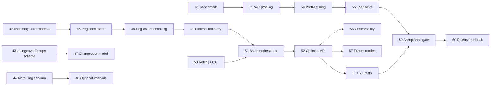

# Production Planning Master Plan — Module 3: CP-SAT Planning Engine & Scale

**Scope:** Steps **41–60** · **Open Mercato** `production_planning` + **ortools-scheduler** Python service  
**Prerequisite:** Modules 1–2 complete (steps 1–40): foundation entities, basic CP-SAT bridge, `POST /api/production_planning/optimize`, monolithic solve, async jobs, initial chunking).

**Scale targets for this module**

| Dimension | Target |
|-----------|--------|
| Work centers | 150 concurrent `NoOverlap` groups |
| Chunk size | ≤500 operations per CP-SAT solve |
| Rolling horizon | Auto at 600+ operations (168h window, 24h overlap) |
| Cross-order constraints | `assemblyLinks` (peg / finish-to-start) |
| Routing flexibility | Optional intervals for alternative routings |
| Changeover | Group-based setup penalties (`changeoverGroups`) |
| Carry-forward | `fixedOperations` + `workCenterFloors` between chunks/windows |
| Chunking strategy | Peg-aware (do not split peg-linked order clusters) |

**Owners key**

| Owner | Responsibility |
|-------|----------------|
| **Solver (Python)** | `services/ortools-scheduler` — CP-SAT model, rolling, profiles |
| **Mercato Backend** | `apps/mercato/.../production_planning` — payload, chunking, optimize API |
| **DevOps / SRE** | Docker, load tests, observability, capacity |
| **QA** | Synthetic fixtures, acceptance gates, regression suite |

---

## Step 41 — Scale benchmark baseline & synthetic factory fixture

**Deliverable:** Reproducible benchmark harness (`benchmarks/scale_baseline.py` + Mercato seed script) generating a **150 work-center / 2,500-operation** factory dataset with realistic due dates, SKUs, and routing depth.

**Owner:** QA + Solver (Python)

**Acceptance criteria:**
- Fixture produces exactly 150 distinct `workCenterCode` values and ≥2,500 schedulable operations across ≥100 production orders.
- Baseline run records p50/p95 solve time, peak RSS, and CP-SAT `solver_status` for monolithic (≤500 ops) and rolling (600+ ops) modes.
- Results committed as `benchmarks/results/module3-baseline.json` with machine spec and OR-Tools version pinned.

---

## Step 42 — Shared schema: `assemblyLinks` (cross-order precedence)

**Deliverable:** Versioned JSON schema additions in Mercato `ortools-bridge.ts` and Python `app/schemas.py`:

```json
{ "assemblyLinks": [{ "predecessorOperationId", "successorOperationId", "lagMinutes" }] }
```

**Owner:** Mercato Backend + Solver (Python)

**Acceptance criteria:**
- Pydantic + Zod validation reject self-links, unknown operation IDs, and negative `lagMinutes`.
- OpenAPI / bridge types stay in sync (camelCase Mercato ↔ Python aliases).
- Unit tests cover 0, 1, and N links; invalid payloads return 422 with field paths.

---

## Step 43 — Shared schema: `changeoverGroups` & setup matrices

**Deliverable:** Schema for group-based changeover modeling:

```json
{
  "changeoverGroups": [{
    "workCenterCode": "WC-PAINT",
    "groupKeyField": "productSku",
    "setupMinutes": 45,
    "matrix": [{ "fromGroup", "toGroup", "setupMinutes" }]
  }]
}
```

**Owner:** Solver (Python) + Mercato Backend

**Acceptance criteria:**
- Groups resolve from operation/order metadata (`productSku` default; extensible field name).
- Matrix entries are optional; missing pairs fall back to `setupMinutes`.
- Schema documented in `.ai/specs/2026-05-23-production-planning-cpsat-ortools.md` cross-link.

---

## Step 44 — Shared schema: alternative routings (`routingAlternatives`)

**Deliverable:** Per-operation optional routing definitions supporting CP-SAT optional intervals:

```json
{
  "routingAlternatives": [{
    "operationId": "...",
    "alternatives": [
      { "workCenterCode": "WC-A", "durationMinutes": 60 },
      { "workCenterCode": "WC-B", "durationMinutes": 75 }
    ]
  }]
}
```

**Owner:** Mercato Backend

**Acceptance criteria:**
- Exactly one alternative selected per operation in any feasible schedule.
- Payload builder emits alternatives only for operations flagged `allowAltRouting` in DB (migration if needed).
- Python schema validates ≥2 alternatives when block present; primary routing remains backward compatible when block omitted.

---

## Step 45 — CP-SAT constraints: `assemblyLinks` (peg-aware precedence)

**Deliverable:** `app/solver/constraints/assembly.py` — for each link, `end(predecessor) + lag ≤ start(successor)` across orders; integrated in monolithic and rolling window solves.

**Owner:** Solver (Python)

**Acceptance criteria:**
- Synthetic two-order peg fixture schedules successor after predecessor + lag on shared and distinct work centers.
- Infeasible peg (successor due before predecessor can finish) yields `solver_status` INFEASIBLE with actionable `message`.
- Rolling windows preserve links when both ops fall in window; cross-window links promote predecessor into earlier window or defer successor via `deferredOperationIds`.

---

## Step 46 — CP-SAT model: optional intervals for alternative routings

**Deliverable:** Refactor interval creation to `AddExactlyOne` over optional interval literals per alt-routing operation; `NoOverlap` uses presence literals per work center.

**Owner:** Solver (Python)

**Acceptance criteria:**
- Feasible solve selects one WC per alt-routing op; unselected intervals absent from schedule output.
- Order-internal precedence respects chosen branch durations.
- Property test: for every alt-routing op, scheduled WC ∈ declared alternatives and duration matches chosen branch.

---

## Step 47 — CP-SAT model: `changeoverGroups` with sequence-dependent setup

**Deliverable:** Replace SKU pairwise heuristic with group-based sequence constraints on each work center: enforced minimum gap between consecutive operations when group changes (matrix-aware).

**Owner:** Solver (Python)

**Acceptance criteria:**
- On 3-op same-WC fixture with groups A→B→A, schedule respects matrix setup minutes between consecutive pairs.
- At >200 ops or >50 ops/WC, documented fallback activates (makespan-only or sampled pairs) matching README thresholds.
- `minimize_changeover` objective term weights documented and unit-tested.

---

## Step 48 — Peg-aware chunking in Mercato (`cpsat-chunking.ts`)

**Deliverable:** `partitionOrdersByOperationCap` upgrade: build peg clusters from `assemblyLinks` + within-order routing; never split a cluster across chunks unless single cluster exceeds 500 ops (hard error).

**Owner:** Mercato Backend

**Acceptance criteria:**
- Given orders {A,B,C} where B pegs A and C independent, chunk boundary never separates A from B.
- `buildScheduleBatch` sets `chunk.operationIds` covering full peg closure.
- Unit tests in `cpsat-chunking.test.ts` for chain pegs, diamond pegs, and oversize cluster error `PEG_CLUSTER_EXCEEDS_MAX_OPERATIONS`.

---

## Step 49 — Harden `workCenterFloors` & `fixedOperations` carry-forward

**Deliverable:** Deterministic merge logic in `cpsat-batch-solve.ts` and Python preprocess: after each chunk/window, emit updated floors from max end per WC; pin in-progress/near-term ops as `fixedOperations`.

**Owner:** Mercato Backend + Solver (Python)

**Acceptance criteria:**
- Multi-chunk batch (3×500 ops) produces non-overlapping schedules on shared work centers without manual intervention.
- Second chunk receives floors ≥ first chunk max end per WC (± slot alignment).
- Ops with `plannedStartAt` within freeze horizon (configurable, default 4h) appear in `fixedOperations` and remain immovable.

---

## Step 50 — Rolling horizon at 600+ ops across 150 work centers

**Deliverable:** Tune `app/solver/rolling.py` for 150-WC instances: window op cap, overlap pinning, deferred-op promotion; auto-enable when total ops ≥600 (existing preprocess gate verified at scale).

**Owner:** Solver (Python)

**Acceptance criteria:**
- 800-op / 150-WC synthetic run completes with `strategy: "rolling"` and ≥3 `windows` in response.
- No WC double-booked across window boundaries (validated by post-solve checker).
- Overlap region re-schedules freely except `fixedOperations` inside freeze band.

---

## Step 51 — Batch orchestration: sequential chunk pipeline with progress

**Deliverable:** `cpsat-batch-solve.ts` orchestrator invoked from `cpsat-optimize-runner.ts`: sequential POSTs to `/schedule`, accumulate schedule, thread floors/fixed state, expose chunk index to caller.

**Owner:** Mercato Backend

**Acceptance criteria:**
- 1,200-op peg-aware batch executes 3 chunks without timeout at default `ORTOOLS_BRIDGE_TIMEOUT_MS`.
- Partial failure on chunk N aborts apply; returns `{ failedChunkIndex, completedChunks, carryForwardEndAt }`.
- Dry-run mode returns merged schedule without DB writes.

---

## Step 52 — Integrate batch + rolling into existing `POST /optimize` API

**Deliverable:** Extend `api/optimize/route.ts` and async worker to pass `assemblyLinks`, `changeoverGroups`, `routingAlternatives`; auto-select monolithic / chunk / rolling based on op count; preserve sync/async/`mode: auto` behavior.

**Owner:** Mercato Backend

**Acceptance criteria:**
- Existing clients (no new fields) behave identically on ≤500-op datasets.
- 202 async response includes `chunkCount`, `strategy`, and poll URL; job record stores per-chunk solver metadata.
- `applySync: true` writes final merged schedule; `dryRun: true` returns preview JSON.

---

## Step 53 — 150 work-center memory & model-build profiling

**Deliverable:** Profiling report + optimizations: lazy WC interval lists, cap optional literals, guard horizon slots; config `MAX_WORK_CENTERS=200` validation in schemas.

**Owner:** Solver (Python) + DevOps / SRE

**Acceptance criteria:**
- 500-op / 150-WC model build completes in <10s on baseline hardware.
- Peak RSS during single chunk solve ≤2 GB (documented env: 4 vCPU / 8 GB).
- Request with 151+ distinct WCs returns 422 unless `allowExtendedWorkCenters` feature flag set.

---

## Step 54 — LARGE-tier CP-SAT profile tuning for 500-op chunks

**Deliverable:** Calibrated `CPSAT_PROFILES[LARGE]` via benchmark grid; env overrides `CPSAT_LARGE_TIME_LIMIT_SEC`, `CPSAT_NUM_WORKERS`; gap limit justified for planning UX.

**Owner:** Solver (Python)

**Acceptance criteria:**
- 500-op chunk reaches FEASIBLE or OPTIMAL within 300s default on baseline fixture.
- When time limit hit, response includes best-so-far schedule if CP-SAT returns feasible incumbent (`solver_status` FEASIBLE documented).
- Profile changes covered by `test_scheduler.py` tier tests.

---

## Step 55 — Load-test harness & CI smoke gate

**Deliverable:** `loadtest/` scripts (k6 or locust) hitting Mercato `/optimize` and direct `/schedule`; CI job `cpsat-scale-smoke` on PRs touching solver or chunking.

**Owner:** DevOps / SRE + QA

**Acceptance criteria:**
- Smoke: 600-op async optimize completes end-to-end in CI within 15 minutes (or skipped with `SCALE_TEST=1` nightly).
- Load test report: 5 concurrent 500-op solves without 5xx or OOM.
- Artifacts uploaded: solver logs, timing, memory.

---

## Step 56 — Observability: chunk/window tracing & metrics

**Deliverable:** Structured logs (JSON) with `batchId`, `chunkIndex`, `windowIndex`, `solver_status`, `objective_value`, duration_ms; Mercato job table columns or JSONB `solverMeta`; optional Prometheus `/metrics` on Python service.

**Owner:** DevOps / SRE + Mercato Backend

**Acceptance criteria:**
- Single async job trace reconstructable from logs alone (chunk sequence, carry-forward floors).
- Dashboard or documented LogQL queries for p95 chunk duration and INFEASIBLE rate.
- No PII in solver logs (order codes optional/redacted via config).

---

## Step 57 — Failure modes: partial schedules, deferred ops, operator messaging

**Deliverable:** Unified error catalog (`CPSAT_*` codes) surfaced through optimize API; UI-ready messages for INFEASIBLE, TIMEOUT, PEG_CLUSTER_EXCEEDS_MAX, BRIDGE_DOWN; `deferredOperationIds` persisted on job for replan.

**Owner:** Mercato Backend

**Acceptance criteria:**
- Each failure code mapped in `i18n/en.json` with operator-facing text.
- INFEASIBLE response identifies conflicting constraint class (peg / WC overlap / due date) when detectable.
- Deferred ops excluded from `apply-cpsat-schedule.ts` write; listed in API response for manual follow-up.

---

## Step 58 — End-to-end integration test suite (Mercato ↔ Python)

**Deliverable:** Docker Compose test stack (`docker-compose.cpsat-test.yml`) running Mercato + ortools-scheduler; integration specs covering monolithic, 3-chunk batch, rolling, peg links, alt routing, changeover groups.

**Owner:** QA + Mercato Backend

**Acceptance criteria:**
- ≥12 integration scenarios green in CI.
- Tests use real HTTP bridge (not mocked solver) with ≤60s per scenario timeout.
- Covers `POST /api/production_planning/optimize` sync and async paths.

---

## Step 59 — Performance & quality acceptance gate (Module 3 sign-off)

**Deliverable:** Signed acceptance report against scale SLOs:

| SLO | Target |
|-----|--------|
| 2,500 ops, peg-aware, 150 WC | Full optimize <5 min async |
| 500-op chunk | p95 ≤300s solver time |
| Schedule feasibility | 0 WC overlaps post-check |
| Peg integrity | 100% links satisfied ± lag |

**Owner:** QA + Product / Planning SME

**Acceptance criteria:**
- All SLOs pass on baseline fixture (Step 41) in staging environment.
- Known gaps documented with severity and Module 4 backlog IDs.
- Product / Planning SME sign-off recorded in report.

---

## Step 60 — Module 3 release checklist, runbook & handoff

**Deliverable:** Production runbook (`docs/production-planning/cpsat-scale-runbook.md`): deploy order, env vars, scaling guidance (replicas, CPU/RAM), rollback, troubleshooting INFEASIBLE/deferred ops; Module 3 release checklist; update `AGENTS.md` and CP-SAT spec.

**Owner:** DevOps / SRE + Mercato Backend

**Acceptance criteria:**
- Runbook covers horizontal scale of ortools-scheduler (N replicas, sticky-less), Mercato queue concurrency limits, and timeout tuning.
- Release checklist verified in staging dry run (deploy → smoke → monitor → rollback drill).
- Module 4 dependencies listed (e.g., UI schedule diff, real-time rescheduling, MRP pegging import).

---

## Module 3 dependency graph (summary)



---

## References

- `.ai/specs/2026-05-23-production-planning-cpsat-ortools.md`
- `services/ortools-scheduler/README.md`
- `apps/mercato/src/modules/production_planning/AGENTS.md`
