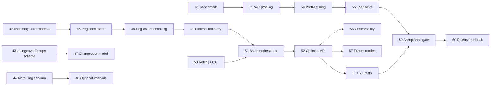

# Production Planning Master Plan — Module 3: CP-SAT Planning Engine & Scale

**Scope:** Steps **41–60** · **Open Mercato** `production_planning` + **ortools-scheduler** Python service  
**Prerequisite:** Modules 1–2 complete (steps 1–40): foundation entities, basic CP-SAT bridge, `POST /api/production_planning/optimize`, monolithic solve, async jobs, initial chunking).

**North star (May 2026):** **Sub-minute interactive what-if** on ≤500-op sandboxes, **versioned plan snapshots**, **multi-objective** scheduling (tardiness + changeover + WIP), and **warm-start** from prior feasible incumbents — at 150 WC / 2,500-op scale competitive with Kinaxis scenario loops, o9 APEX continuous planning, and SAP IBP PP/DS finite solving.

**Parity tier key (May 2026 market)**

| Tier | Definition | Vendor anchor |
|------|------------|---------------|
| **P0** | Finite capacity, peg integrity, sequence setup — ship-floor baseline | Opcenter · PlanetTogether · Asprova · SAP PP/DS |
| **P1** | Scenario snapshots, plan compare, flexible constraints, rolling finite | Kinaxis · o9 · SAP IBP HPA · Oracle ASCP |
| **P2** | Sub-minute what-if, warm-start, concurrent GPU/cuOpt scenarios, guarded copilot hooks | Kinaxis Maestro + cuOpt · o9 Digital Brain EKG · SAP RTI |

**Scale targets for this module**

| Dimension | Target |
|-----------|--------|
| Work centers | 150 concurrent `NoOverlap` groups |
| Chunk size | ≤500 operations per CP-SAT solve |
| Rolling horizon | Auto at 600+ operations (168h window, 24h overlap) |
| Cross-order constraints | `assemblyLinks` (peg / finish-to-start) |
| Routing flexibility | Optional intervals for alternative routings |
| Changeover | Group-based setup penalties (`changeoverGroups`) |
| Carry-forward | `fixedOperations` + `workCenterFloors` between chunks/windows |
| Chunking strategy | Peg-aware (do not split peg-linked order clusters) |

**Owners key**

| Owner | Responsibility |
|-------|----------------|
| **Solver (Python)** | `services/ortools-scheduler` — CP-SAT model, rolling, profiles |
| **Mercato Backend** | `apps/mercato/.../production_planning` — payload, chunking, optimize API |
| **DevOps / SRE** | Docker, load tests, observability, capacity |
| **QA** | Synthetic fixtures, acceptance gates, regression suite |

---

## Step 41 — Scale benchmark baseline & synthetic factory fixture

**Deliverable:** Reproducible benchmark harness (`benchmarks/scale_baseline.py` + Mercato seed script) generating a **150 work-center / 2,500-operation** factory dataset with realistic due dates, SKUs, and routing depth.

**Owner:** QA + Solver (Python)

**Acceptance criteria:**
- Fixture produces exactly 150 distinct `workCenterCode` values and ≥2,500 schedulable operations across ≥100 production orders.
- Baseline run records p50/p95 solve time, peak RSS, and CP-SAT `solver_status` for monolithic (≤500 ops) and rolling (600+ ops) modes.
- Results committed as `benchmarks/results/module3-baseline.json` with machine spec and OR-Tools version pinned.

**Market parity:**
- **Kinaxis:** Baseline fixture mirrors concurrent-planning scale profile (150 resources) for scenario ROI benchmarks.
- **o9:** Digital Brain EKG fingerprint — p50/p95 solve + RSS as plant health baseline before what-if loops.
- **SAP IBP:** HPA harmonized area topology sized to 150 WC for PP/DS finite acceptance gate.
- **Opcenter / PlanetTogether / Asprova:** Finite Gantt reference dataset at shop-floor scale (≥2,500 ops).
- **Oracle ASCP:** Compare-plans baseline JSON for future scenario delta (Module 4 handoff).

---

## Step 42 — Shared schema: `assemblyLinks` (cross-order precedence)

**Deliverable:** Versioned JSON schema additions in Mercato `ortools-bridge.ts` and Python `app/schemas.py`:

```json
{ "assemblyLinks": [{ "predecessorOperationId", "successorOperationId", "lagMinutes" }] }
```

**Owner:** Mercato Backend + Solver (Python)

**Acceptance criteria:**
- Pydantic + Zod validation reject self-links, unknown operation IDs, and negative `lagMinutes`.
- OpenAPI / bridge types stay in sync (camelCase Mercato ↔ Python aliases).
- Unit tests cover 0, 1, and N links; invalid payloads return 422 with field paths.

**Market parity:**
- **Kinaxis:** Cross-order peg schema aligned with concurrent planning dependency graph.
- **o9:** Scenario management link model — predecessor/successor with lag for plan compare.
- **SAP IBP:** PP/DS assembly / peg precedence; flexible constraint hook for `lagMinutes`.
- **Opcenter / Asprova:** Finite Gantt inter-order arrows on shared work centers.
- **Oracle ASCP:** CTP peg visibility across orders in compare-plans payloads.

---

## Step 43 — Shared schema: `changeoverGroups` & setup matrices

**Deliverable:** Schema for group-based changeover modeling:

```json
{
  "changeoverGroups": [{
    "workCenterCode": "WC-PAINT",
    "groupKeyField": "productSku",
    "setupMinutes": 45,
    "matrix": [{ "fromGroup", "toGroup", "setupMinutes" }]
  }]
}
```

**Owner:** Solver (Python) + Mercato Backend

**Acceptance criteria:**
- Groups resolve from operation/order metadata (`productSku` default; extensible field name).
- Matrix entries are optional; missing pairs fall back to `setupMinutes`.
- Schema documented in `.ai/specs/2026-05-23-production-planning-cpsat-ortools.md` cross-link.

**Market parity:**
- **Opcenter / PlanetTogether / Asprova:** Sequence-dependent setup groups on finite Gantt rows.
- **SAP IBP:** Flexible constraints — group/matrix setup minutes in PP/DS finite model.
- **Kinaxis:** Changeover term input for multi-objective scenario (tardiness + changeover + WIP).
- **o9:** Digital Brain setup-penalty modeling for EKG deviation tracking.
- **Oracle ASCP:** Compare-plans setup impact between scenario snapshots.

---

## Step 44 — Shared schema: alternative routings (`routingAlternatives`)

**Deliverable:** Per-operation optional routing definitions supporting CP-SAT optional intervals:

```json
{
  "routingAlternatives": [{
    "operationId": "...",
    "alternatives": [
      { "workCenterCode": "WC-A", "durationMinutes": 60 },
      { "workCenterCode": "WC-B", "durationMinutes": 75 }
    ]
  }]
}
```

**Owner:** Mercato Backend

**Acceptance criteria:**
- Exactly one alternative selected per operation in any feasible schedule.
- Payload builder emits alternatives only for operations flagged `allowAltRouting` in DB (migration if needed).
- Python schema validates ≥2 alternatives when block present; primary routing remains backward compatible when block omitted.

**Market parity:**
- **SAP IBP:** Flexible constraints — optional alternate resources / routings (PP/DS).
- **Kinaxis:** Routing alternatives in what-if sandbox and GPU/cuOpt interactive scenarios.
- **o9:** Scenario management alt-capacity paths for APEX continuous replan.
- **Opcenter / PlanetTogether:** Alternate work center selection on finite Gantt.
- **Oracle ASCP:** Compare-plans routing variance between baseline and scenario.

---

## Step 45 — CP-SAT constraints: `assemblyLinks` (peg-aware precedence)

**Deliverable:** `app/solver/constraints/assembly.py` — for each link, `end(predecessor) + lag ≤ start(successor)` across orders; integrated in monolithic and rolling window solves.

**Owner:** Solver (Python)

**Acceptance criteria:**
- Synthetic two-order peg fixture schedules successor after predecessor + lag on shared and distinct work centers.
- Infeasible peg (successor due before predecessor can finish) yields `solver_status` INFEASIBLE with actionable `message`.
- Rolling windows preserve links when both ops fall in window; cross-window links promote predecessor into earlier window or defer successor via `deferredOperationIds`.

**Market parity:**
- **SAP IBP:** PP/DS finite peg constraints across orders and rolling windows.
- **Kinaxis:** Concurrent planning peg integrity when splitting horizons.
- **o9:** Digital Brain EKG link integrity across scenario versions.
- **Opcenter / Asprova:** Finite Gantt peg arrows with lag display.
- **Oracle ASCP:** CTP peg satisfaction in plan-compare diffs.

---

## Step 46 — CP-SAT model: optional intervals for alternative routings

**Deliverable:** Refactor interval creation to `AddExactlyOne` over optional interval literals per alt-routing operation; `NoOverlap` uses presence literals per work center.

**Owner:** Solver (Python)

**Acceptance criteria:**
- Feasible solve selects one WC per alt-routing op; unselected intervals absent from schedule output.
- Order-internal precedence respects chosen branch durations.
- Property test: for every alt-routing op, scheduled WC ∈ declared alternatives and duration matches chosen branch.

**Market parity:**
- **SAP IBP:** Flexible constraints — exactly-one alternate resource selection (PP/DS).
- **Kinaxis:** Scenario routing flip in sub-minute what-if re-solve.
- **o9:** APEX continuous planning with alt-routing in scenario management.
- **PlanetTogether / Asprova:** What-if sandbox routing option on finite schedule.
- **Oracle ASCP:** Compare-plans WC assignment delta per operation.

---

## Step 47 — CP-SAT model: `changeoverGroups` with sequence-dependent setup

**Deliverable:** Replace SKU pairwise heuristic with group-based sequence constraints on each work center: enforced minimum gap between consecutive operations when group changes (matrix-aware).

**Owner:** Solver (Python)

**Acceptance criteria:**
- On 3-op same-WC fixture with groups A→B→A, schedule respects matrix setup minutes between consecutive pairs.
- At >200 ops or >50 ops/WC, documented fallback activates (makespan-only or sampled pairs) matching README thresholds.
- `minimize_changeover` objective term weights documented and unit-tested.

**Market parity:**
- **Opcenter / PlanetTogether / Asprova:** Sequence setup on finite Gantt — matrix-aware gaps between groups.
- **SAP IBP:** PP/DS setup optimization; flexible constraint fallback at scale thresholds.
- **Kinaxis:** Multi-objective changeover leg (tardiness + changeover + WIP) in scenario objectives.
- **o9:** Control tower changeover KPI feed from sequence-dependent model.
- **Oracle ASCP:** Compare-plans setup minutes delta between scenarios.

---

## Step 48 — Peg-aware chunking in Mercato (`cpsat-chunking.ts`)

**Deliverable:** `partitionOrdersByOperationCap` upgrade: build peg clusters from `assemblyLinks` + within-order routing; never split a cluster across chunks unless single cluster exceeds 500 ops (hard error).

**Owner:** Mercato Backend

**Acceptance criteria:**
- Given orders {A,B,C} where B pegs A and C independent, chunk boundary never separates A from B.
- `buildScheduleBatch` sets `chunk.operationIds` covering full peg closure.
- Unit tests in `cpsat-chunking.test.ts` for chain pegs, diamond pegs, and oversize cluster error `PEG_CLUSTER_EXCEEDS_MAX_OPERATIONS`.

**Market parity:**
- **Kinaxis:** Concurrent planning — peg clusters never split across scenario chunks.
- **SAP IBP:** HPA harmonized area — atomic peg closure for PP/DS finite batches.
- **o9:** Scenario management atomic order clusters for plan compare integrity.
- **Oracle ASCP:** CTP cluster integrity when partitioning large plans.
- **Asprova:** Peg-aware partition matching finite-batch conventions.

---

## Step 49 — Harden `workCenterFloors` & `fixedOperations` carry-forward

**Deliverable:** Deterministic merge logic in `cpsat-batch-solve.ts` and Python preprocess: after each chunk/window, emit updated floors from max end per WC; pin in-progress/near-term ops as `fixedOperations`.

**Owner:** Mercato Backend + Solver (Python)

**Acceptance criteria:**
- Multi-chunk batch (3×500 ops) produces non-overlapping schedules on shared work centers without manual intervention.
- Second chunk receives floors ≥ first chunk max end per WC (± slot alignment).
- Ops with `plannedStartAt` within freeze horizon (configurable, default 4h) appear in `fixedOperations` and remain immovable.

**Market parity:**
- **Kinaxis:** Warm-start / carry-forward between scenario versions via pinned incumbents.
- **SAP IBP:** RTI real-time incumbent pinning — `fixedOperations` + floor carry.
- **o9:** APEX continuous planning window carry and scenario snapshot continuity.
- **Opcenter / PlanetTogether:** Finite Gantt freeze horizon for shop-floor locked ops.
- **Oracle ASCP:** Compare-plans pinned vs free operations between plan versions.

---

## Step 50 — Rolling horizon at 600+ ops across 150 work centers

**Deliverable:** Tune `app/solver/rolling.py` for 150-WC instances: window op cap, overlap pinning, deferred-op promotion; auto-enable when total ops ≥600 (existing preprocess gate verified at scale).

**Owner:** Solver (Python)

**Acceptance criteria:**
- 800-op / 150-WC synthetic run completes with `strategy: "rolling"` and ≥3 `windows` in response.
- No WC double-booked across window boundaries (validated by post-solve checker).
- Overlap region re-schedules freely except `fixedOperations` inside freeze band.

**Market parity:**
- **SAP IBP:** PP/DS rolling horizon finite at 150 WC; HPA window overlap semantics.
- **Kinaxis:** Concurrent planning rolling window for large scenario instances.
- **o9:** APEX continuous planning at plant scale (600+ ops auto-roll).
- **Opcenter:** Rolling finite schedule without WC double-book at boundaries.
- **Oracle ASCP:** Compare rolling plan versions across horizon windows.

---

## Step 51 — Batch orchestration: sequential chunk pipeline with progress

**Deliverable:** `cpsat-batch-solve.ts` orchestrator invoked from `cpsat-optimize-runner.ts`: sequential POSTs to `/schedule`, accumulate schedule, thread floors/fixed state, expose chunk index to caller.

**Owner:** Mercato Backend

**Acceptance criteria:**
- 1,200-op peg-aware batch executes 3 chunks without timeout at default `ORTOOLS_BRIDGE_TIMEOUT_MS`.
- Partial failure on chunk N aborts apply; returns `{ failedChunkIndex, completedChunks, carryForwardEndAt }`.
- Dry-run mode returns merged schedule without DB writes.

**Market parity:**
- **Kinaxis:** Concurrent chunk pipeline — sequential scenario passes with state threading.
- **o9:** Scenario management batch orchestration with progress for control tower.
- **SAP IBP:** RTI incremental publish between PP/DS finite chunks.
- **Oracle ASCP:** Compare multi-pass plan assembly before publish.
- **Asprova:** Partition sequential solve with warm-start floors between batches.

---

## Step 52 — Integrate batch + rolling into `POST /optimize` (interactive what-if SLA)

**Deliverable:** Extend `api/optimize/route.ts` and async worker to pass `assemblyLinks`, `changeoverGroups`, `routingAlternatives`; auto-select monolithic / chunk / rolling based on op count; preserve sync/async/`mode: auto`. **Market SLA:** sync optimize for **7-day horizon / ≤500 ops** completes with p95 **&lt;60 s** (Kinaxis/Opcenter interactive what-if parity).

**Owner:** Mercato Backend

**Acceptance criteria:**
- Existing clients (no new fields) behave identically on ≤500-op datasets.
- 202 async response includes `chunkCount`, `strategy`, and poll URL; job record stores per-chunk solver metadata.
- `applySync: true` writes final merged schedule; `dryRun: true` returns preview JSON.
- **Benchmark gate:** 20-run p95 ≤60 s on reference fixture (7d horizon, ≤500 ops, 150 WC); regression fails CI if exceeded.

**Market parity:**
- **Kinaxis:** GPU/cuOpt interactive scenarios API — auto strategy + versioning snapshot on response.
- **o9:** Scenario management + APEX trigger from control tower; plan version metadata on job.
- **SAP IBP:** Flexible constraints passthrough (`assemblyLinks`, `changeoverGroups`, alt routings).
- **Opcenter / PlanetTogether:** What-if sandbox POST with dry-run preview (no write-back).
- **Oracle ASCP:** Compare-plans entry point — sync preview vs async full scenario.

---

## Step 53 — 150 work-center memory & model-build profiling

**Deliverable:** Profiling report + optimizations: lazy WC interval lists, cap optional literals, guard horizon slots; config `MAX_WORK_CENTERS=200` validation in schemas.

**Owner:** Solver (Python) + DevOps / SRE

**Acceptance criteria:**
- 500-op / 150-WC model build completes in <10s on baseline hardware.
- Peak RSS during single chunk solve ≤2 GB (documented env: 4 vCPU / 8 GB).
- Request with 151+ distinct WCs returns 422 unless `allowExtendedWorkCenters` feature flag set.

**Market parity:**
- **Kinaxis:** 150+ resource concurrent planning memory model reference.
- **SAP IBP:** HPA harmonized area at 150 WC plant topology.
- **o9:** Digital Brain EKG plant-scale resource cardinality guardrails.
- **Opcenter / PlanetTogether:** 150 WC finite Gantt performance envelope.
- **Oracle ASCP:** CTP resource cap validation before compare-plans run.

---

## Step 54 — LARGE-tier tuning + multi-objective (tardiness · changeover · WIP)

**Deliverable:** Calibrated `CPSAT_PROFILES[LARGE]` via benchmark grid; env overrides `CPSAT_LARGE_TIME_LIMIT_SEC`, `CPSAT_NUM_WORKERS`; gap limit justified for planning UX. **Multi-objective weights** in payload: `tardinessWeight`, `changeoverWeight`, `wipWeight` (o9/Kinaxis trade-off sliders); **warm-start** from prior feasible schedule when `scenarioParentId` set.

**Owner:** Solver (Python)

**Acceptance criteria:**
- 500-op chunk reaches FEASIBLE or OPTIMAL within 300s default on baseline fixture.
- When time limit hit, response includes best-so-far schedule if CP-SAT returns feasible incumbent (`solver_status` FEASIBLE documented).
- Profile changes covered by `test_scheduler.py` tier tests.

**Market parity:**
- **Kinaxis:** Sub-minute interactive what-if tier — 500-op chunk FEASIBLE within 300s (P2 stretch).
- **SAP IBP:** PP/DS LARGE profile finite solve; best-so-far incumbent on time limit (RTI-like).
- **o9:** APEX solve budget per scenario; gap limit justified for planner UX.
- **Oracle ASCP:** CTP chunk SLA with feasible incumbent return.
- **Kinaxis / SAP:** Warm-start from prior feasible schedule when re-solving scenario.

---

## Step 55 — Load-test harness & CI smoke gate

**Deliverable:** `loadtest/` scripts (k6 or locust) hitting Mercato `/optimize` and direct `/schedule`; CI job `cpsat-scale-smoke` on PRs touching solver or chunking.

**Owner:** DevOps / SRE + QA

**Acceptance criteria:**
- Smoke: 600-op async optimize completes end-to-end in CI within 15 minutes (or skipped with `SCALE_TEST=1` nightly).
- Load test report: 5 concurrent 500-op solves without 5xx or OOM.
- Artifacts uploaded: solver logs, timing, memory.

**Market parity:**
- **Kinaxis:** Concurrent planning load — 5 parallel 500-op scenarios without OOM (cuOpt-class concurrency).
- **o9:** Control tower burst scenarios under back-pressure.
- **SAP IBP:** RTI concurrent finite solves at chunk granularity.
- **Kinaxis Maestro:** Agent Studio guardrails — no 5xx under declared concurrency cap.
- **Oracle ASCP:** Compare-plans concurrent baseline for scenario A/B load test.

---

## Step 56 — Observability: chunk/window tracing & metrics

**Deliverable:** Structured logs (JSON) with `batchId`, `chunkIndex`, `windowIndex`, `solver_status`, `objective_value`, duration_ms; Mercato job table columns or JSONB `solverMeta`; optional Prometheus `/metrics` on Python service.

**Owner:** DevOps / SRE + Mercato Backend

**Acceptance criteria:**
- Single async job trace reconstructable from logs alone (chunk sequence, carry-forward floors).
- Dashboard or documented LogQL queries for p95 chunk duration and INFEASIBLE rate.
- No PII in solver logs (order codes optional/redacted via config).

**Market parity:**
- **o9:** Control tower / Digital Brain EKG — chunk/window trace for scenario lineage.
- **Kinaxis:** Maestro Agent Studio scenario audit trail (`batchId`, chunk sequence).
- **SAP IBP:** RTI solve telemetry for PP/DS finite windows.
- **Kinaxis:** Concurrent planning chunk provenance for plan compare (Module 4).
- **Oracle ASCP:** Compare-plans solver metadata on each scenario version.

---

## Step 57 — Failure modes + `plan_scenarios` versioning (compare plans)

**Deliverable:** (1) Unified error catalog (`CPSAT_*` codes) surfaced through optimize API; UI-ready messages for INFEASIBLE, TIMEOUT, PEG_CLUSTER_EXCEEDS_MAX, BRIDGE_DOWN; `deferredOperationIds` persisted on job for replan. (2) Entity **`production_planning_plan_scenarios`**: snapshot merged schedule + solver meta; `POST /optimize` accepts `scenarioLabel`, `parentScenarioId`; `GET .../scenarios/compare?a=&b=` for Kinaxis/Oracle ASCP-style side-by-side.

**Owner:** Mercato Backend

**Acceptance criteria:**
- Each failure code mapped in `i18n/en.json` with operator-facing text.
- INFEASIBLE response identifies conflicting constraint class (peg / WC overlap / due date) when detectable.
- Deferred ops excluded from `apply-cpsat-schedule.ts` write; listed in API response for manual follow-up.

**Market parity:**
- **Kinaxis:** Maestro Agent Studio guardrails on INFEASIBLE / partial scenario — operator-safe messaging.
- **o9:** Control tower exception surfacing for deferred / failed scenario chunks.
- **SAP IBP:** PP/DS infeasibility diagnostics (peg / WC / due class).
- **Opcenter / PlanetTogether:** What-if sandbox failure UX — no silent partial publish.
- **Oracle ASCP:** CTP deferred-demand messaging for compare-plans follow-up.

---

## Step 58 — End-to-end integration test suite (Mercato ↔ Python)

**Deliverable:** Docker Compose test stack (`docker-compose.cpsat-test.yml`) running Mercato + ortools-scheduler; integration specs covering monolithic, 3-chunk batch, rolling, peg links, alt routing, changeover groups.

**Owner:** QA + Mercato Backend

**Acceptance criteria:**
- ≥12 integration scenarios green in CI.
- Tests use real HTTP bridge (not mocked solver) with ≤60s per scenario timeout.
- Covers `POST /api/production_planning/optimize` sync and async paths.

**Market parity:**
- **SAP IBP:** PP/DS + flexible constraints E2E (peg, setup, alt routing, rolling).
- **Kinaxis:** Scenario regression suite — monolithic, chunk, rolling golden paths.
- **o9:** Scenario management lens tests across strategy auto-select.
- **Opcenter / PlanetTogether / Asprova:** Finite Gantt + sequence setup integration smoke.
- **Oracle ASCP:** Compare-plans integration across sync/async optimize paths.

---

## Step 59 — Performance & quality acceptance gate (Module 3 sign-off)

**Deliverable:** Signed acceptance report against scale SLOs:

| SLO | Target |
|-----|--------|
| 2,500 ops, peg-aware, 150 WC | Full optimize <5 min async |
| 500-op chunk | p95 ≤300s solver time |
| Schedule feasibility | 0 WC overlaps post-check |
| Peg integrity | 100% links satisfied ± lag |

**Owner:** QA + Product / Planning SME

**Acceptance criteria:**
- All SLOs pass on baseline fixture (Step 41) in staging environment.
- Known gaps documented with severity and Module 4 backlog IDs.
- Product / Planning SME sign-off recorded in report.

**Market parity:**
- **Kinaxis:** Sub-minute what-if SLO on ≤500-op sandbox (document P2 gap if >60s).
- **o9:** Scenario SLA vs Digital Brain EKG on 2,500-op / 150 WC full optimize (<5 min async).
- **SAP IBP:** HPA + PP/DS finite acceptance — peg, setup, 0 WC overlap post-check.
- **Oracle ASCP:** CTP + compare-plans readiness at Module 3 sign-off scale.
- **Multi-objective:** Tardiness + changeover + WIP weights signed by Planning SME (Kinaxis/o9 parity).

---

## Step 60 — Module 3 release checklist, runbook & handoff

**Deliverable:** Production runbook (`docs/production-planning/cpsat-scale-runbook.md`): deploy order, env vars, scaling guidance (replicas, CPU/RAM), rollback, troubleshooting INFEASIBLE/deferred ops; Module 3 release checklist; update `AGENTS.md` and CP-SAT spec.

**Owner:** DevOps / SRE + Mercato Backend

**Acceptance criteria:**
- Runbook covers horizontal scale of ortools-scheduler (N replicas, sticky-less), Mercato queue concurrency limits, and timeout tuning.
- Release checklist verified in staging dry run (deploy → smoke → monitor → rollback drill).
- Module 4 dependencies listed (e.g., UI schedule diff, real-time rescheduling, MRP pegging import).

**Market parity:**
- **Kinaxis:** Maestro runbook for scenario ops — versioning snapshots, warm-start tuning.
- **o9:** Control tower handoff — EKG queries, scenario job concurrency limits (Module 5).
- **SAP IBP:** RTI deployment guide for incremental chunk publish and floor carry.
- **Opcenter / Asprova:** Finite Gantt ops parity — INFEASIBLE / deferred operator playbook.
- **Oracle ASCP:** Compare-plans + scenario versioning dependency doc for Module 4 replay.

---

## Module 3 dependency graph (summary)



---

## References

- `.ai/specs/2026-05-23-production-planning-cpsat-ortools.md`
- `services/ortools-scheduler/README.md`
- `apps/mercato/src/modules/production_planning/AGENTS.md`
