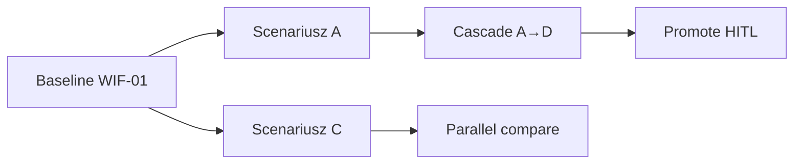

# What-If Scenario Catalog — Production Planning (Maj 2026)

**Wersja:** 1.0 · **Status:** spec + rejestr do implementacji (M3-52, M3-57, M5-87)  
**Powiązane:** [master-plan v2](./2026-05-24-production-planning-master-plan.md) · [market-parity](./2026-05-24-production-planning-market-parity-may-2026.md) · [module-3](./2026-05-24-production-planning-module-3-cpsat-scale-master-plan.md)  
**Rejestr maszynowy:** [`what-if-scenarios.registry.json`](../catalogs/what-if-scenarios.registry.json)

---

## Panel ekspertów (synteza)

| Ekspert | Platforma | Wkład do katalogu |
|---------|-----------|-------------------|
| **Concurrent / IBP** | Kinaxis Maestro, o9 Digital Brain | Taksonomia 7 wymiarów, bundle’e, cascade ≤3, compare 3-lens, chaos premium |
| **Shop-floor APS** | Opcenter 2510, PlanetTogether, Asprova 18 | WIF-01..18, tier S/M/L/XL, MES injection, tournament 5-variant |
| **ERP finite** | SAP IBP HPA + PP/DS, Oracle ASCP | Peg-aware chunk, RTI actuals replay, compare-plans delta |
| **Mercato product** | genesis + hindsight | Każdy scenariusz → `genesis_root_id`; bundle **Chaos Premium** w PLN |

**North star what-if:** planista uruchamia **dowolny szablon &lt;60 s** (Tier M), zapisuje wersję, porównuje A/B/C z baseline, promuje tylko po **HITL** — jak Kinaxis scenario library + Opcenter sandbox.

---

## 1. Taksonomia scenariuszy (7 wymiarów)

Każdy scenariusz ma tagi `dimensions[]` z listy:

| Wymiar | `dimension` | Obiekty override | Horyzont |
|--------|-------------|------------------|----------|
| Szok popytu | `demand_shock` | SO qty/data, forecast, anulowania, rush | krótki → S&OP |
| Disrupt supply | `supply_disruption` | PO delay, brak materiału, BOM zamiennik | średni, pegging |
| Moc | `capacity` | kalendarz WC, zmiana, PM, OEE | krótki, Gantt |
| Routing | `routing` | alt routing, outsource, czasy operacji | średni |
| Priorytet | `priority` | wagi OTIF, freeze, must-start | natychmiast |
| Koszt | `cost` | OT, subcontract, holding, expedite | exec |
| Horyzont | `horizon` | okno planu, as-of, cut informacji | granica wiedzy |

**Stany życia:** `draft` → `simulating` → `completed` | `failed` · domyślnie **`propose_only`** (brak zapisu na live Gantt).

---

## 2. Katalog szablonów — warstwa taktyczna (T-01 … T-18)

Scenariusze **S&OP / planista centralny** — zmiana demand/supply/cost przed lub obok solve.

| ID | Nazwa PL | Trigger | Zmiana wejścia | KPI oczekiwane (Δ vs baseline) | Tier | User |
|----|----------|---------|----------------|--------------------------------|------|------|
| **T-01** | Rush — VIP klient | Eskalacja sales | +SO, waga tardiness ×3 | OTIF VIP ↑, backlog ↓ | S | Planner |
| **T-02** | Szok popytu +20% | Consensus S&OP | forecast bucket +20% | fill rate ↓ lub zapas ↑ | M | S&OP |
| **T-03** | Fala anulowań | Odroczenia klientów | −qty / cancel lines | utilization ↓ | S | Planner |
| **T-04** | Opóźnienie dostawcy | PO +7d | peg delay komponentu | shortage ↑, alt routing ↑ | M | Planner |
| **T-05** | Brak materiału (qty) | GRN partial | cap dostępności | unmet peg | M | Planner |
| **T-06** | Linia wyłączona 48h | Awaria CNC | blackout WC | tardiness SO zależnych ↑ | M | Planner |
| **T-07** | Okno PM planowane | Harmonogram PM | capacity −100% | pre-build / OT | M | Planner |
| **T-08** | Dodatkowa zmiana OT | Zgoda HR | +shift na bottleneck | tardiness ↓, koszt ↑ | M | Planner/Exec |
| **T-09** | Routing — outsource | Make/buy | alt routing subcontract | lead time ↑, load int. ↓ | L | S&OP |
| **T-10** | SMED −30% setup | Inżynieria | setup time ↓ | capacity efektywna ↑ | S | Planner |
| **T-11** | Freeze 4h → 24h | Stabilność hali | więcej `fixedOperations` | stabilność ↑, OTIF global ↓ | M | Planner |
| **T-12** | Re-tier priorytetów | Key account | mapa wag tier A/B/C | OTIF A ↑, C ↓ | M | S&OP |
| **T-13** | Expedite fee OK | Klient płaci | OT + subcontract dozwolone | service ↑, marża ↓ | M | Exec |
| **T-14** | Horyzont 4→8 tyg. | Replen tactical | `horizonHours` ×2 | late ↓, churn ↑ | L | S&OP |
| **T-15** | As-of wczoraj | Hindsight / poniedziałek | cut T−1 | chaos premium ↑ | M | Analytics |
| **T-16** | OEE −10% bottleneck | Spadek wydajności | efficiency WC group | throughput ↓ | M | Planner |
| **T-17** | NPI — nowy produkt | Gate NPI | nowy BOM/routing stub | kolizje setup | L | S&OP |
| **T-18** | Koszt min vs serwis max | Warsztat exec | toggle objective weights | punkt Pareto | M | Exec |

---

## 3. Katalog shop-floor (WIF-01 … WIF-18)

Scenariusze **hala / 150 WC / CP-SAT** — bezpośrednio na payload `POST /optimize`.

| ID | Nazwa | d | Ops | Payload / constraints | Cel badawczy |
|----|-------|---|-----|----------------------|--------------|
| **WIF-01** | Baseline finite | 7 | 350–450 | referencja | warm-start parent |
| **WIF-02** | Lakiernia down 48h | 7 | 400–500 | `workCenterFloors`, alt routing | AW-02 |
| **WIF-03** | CNC częściowy outage | 7 | 300–400 | floor + `fixedOperations` | AW-03 |
| **WIF-04** | Rush AOG | 7 | 420–500 | nowe MO + peg, tardiness ↑ | AW-04 |
| **WIF-05** | OT weekend | 9 | 450–500 | `horizonHours` ↑ | AW-05 |
| **WIF-06** | Konflikt oprzyrządowania | 7 | 250–350 | changeover matrix | AW-06 |
| **WIF-07** | Kampania kolorów | 7 | 400–500 | `changeoverGroups` max | AW-07 |
| **WIF-08** | Kampania stopu | 7 | 350–450 | matrix extrusion | AW-08 |
| **WIF-09** | Freeze sekwencji 4h | 7 | 400–500 | `fixedOperations` | AW-09 |
| **WIF-10** | Split pool MO | 7 | 500–650 | peg fan-in | AW-10 |
| **WIF-11** | Alt routing balance | 7 | 300–450 | `routingAlternatives` 15–25% | AW-11 |
| **WIF-12** | Peg lag tight | 7 | 400–500 | `assemblyLinks.lagMinutes` ↓ | AW-12 |
| **WIF-13** | Peg infeasible probe | 7 | 200–300 | tight due dates | diagnostyka |
| **WIF-14** | Rolling 14d | 14 | 800–1200 | `rolling` auto | skala L |
| **WIF-15** | Chunk 3×500 | 7 | 900–1500 | peg-aware batch | skala L |
| **WIF-16** | WIP-first | 7 | 400–500 | `wipWeight` ↑ | trade-off |
| **WIF-17** | Recovery z parent | 7 | 450–500 | `parentScenarioId` | warm-start |
| **WIF-18** | Full cocktail | 7 | 480–500 | wszystkie constrainty | regresja |

**Tier benchmark:** S ≤200 ops · M ≤500 · L chunk/rolling · XL pełna fabryka 2500 ops.

---

## 4. Bundle’e — pakiety multi-scenariuszowe

Gotowe **ścieżki badań** (uruchom jednym kliknięciem / jednym API `POST .../scenarios/bundles/{id}/run`).

| Bundle ID | Nazwa PL | Scenariusze (kolejność) | Tryb | Odbiorca |
|-----------|----------|-------------------------|------|----------|
| **BND-MONDAY** | Poniedziałek rano | T-15 → T-01 → T-08 | cascade | Planner |
| **BND-ESCALATION** | Eskalacja klienta | T-12 → T-01 → T-13 | cascade | S&OP / Exec |
| **BND-SUPPLY** | Szok supply | T-04 → T-05 → T-09 → T-18 | cascade | Planner |
| **BND-MAINT** | Tydzień PM | T-07 → T-02 (pull-in) → T-11 | cascade | Planner |
| **BND-SOP** | Pakiet S&OP | T-02 (+20%) → T-02 (−20%) → T-14 → T-17 | parallel | S&OP |
| **BND-BOTTLENECK** | Wąskie gardło | T-16 → T-08 → T-10 | parallel | Planner |
| **BND-TOURNAMENT-RUSH** | Turniej rush | WIF-04 × 5 wariantów wag | tournament | Planner |
| **BND-TOURNAMENT-OUTAGE** | Turniej awaria | WIF-02 × 5 wariantów (OT/alt/freeze) | tournament | Planner |
| **BND-CHAOS-ROI** | Chaos premium | T-15 → hindsight perfect → delta PLN | cascade | Exec |
| **BND-GENESIS-AUDIT** | Drzewo genezy | WIF-01 + peg trace per late SO | single+drill | Analytics |

**Cascade:** max **3** poziomy; każdy etap `parentScenarioId` = poprzedni.  
**Tournament:** 3–7 wariantów, `dryRun: true`, ranking po `objectiveValue` + tie-break late count.

---

## 5. Cascade i propagacja (concurrent planning)



| Wzorzec | Opis | Przykład |
|---------|------|----------|
| **Parallel compare** | Ten sam baseline, różne dźwignie | T-08 vs T-09 vs T-10 |
| **Sequential cascade** | Output A → input B | T-04 → T-09 → T-08 |
| **Demand→capacity ripple** | Netting re-run między etapami | T-02 → T-06 → T-08 |
| **As-of cascade** | Granica wiedzy | T-15 → replay z actuals M4 |

---

## 6. Macierz parametrów API (`POST /optimize`)

Pola obecne i planowane (★ = M3-57 / rozszerzenie bridge).

| Pole | Scenariusze | Efekt solvera |
|------|-------------|---------------|
| `horizonHours` | T-14, WIF-05, WIF-14 | Siatka czasu |
| `objective` | T-18, WIF-16 | legacy single objective |
| ★ `tardinessWeight` / `changeoverWeight` / `wipWeight` | wszystkie turnieje | multi-objective |
| `fixedOperations` | T-11, WIF-09, MES | pin operacji |
| `workCenterFloors` | T-06, WIF-02, WIF-03 | blackout / carry-forward |
| ★ `assemblyLinks` | WIF-04,10,12,13 | peg cross-order |
| ★ `changeoverGroups` | WIF-07,08,18 | sequence setup |
| ★ `routingAlternatives` | T-09, WIF-02,11 | FJSP |
| `rolling` | WIF-14,15 | okna 168h / overlap 24h |
| ★ `scenarioLabel` | wszystkie | wersjonowanie |
| ★ `parentScenarioId` | WIF-17, cascade | warm-start |
| `dryRun` | turnieje | brak zapisu DB |
| `applySync` | interactive M | sync ≤500 ops |

**Profile wag (turniej):**

| Profile | tardiness | changeover | wip |
|---------|-----------|------------|-----|
| OTIF-first | 1.0 | 0.2 | 0.1 |
| Balanced | 0.6 | 0.4 | 0.3 |
| Campaign | 0.3 | 1.0 | 0.2 |
| Flow-first | 0.4 | 0.3 | 1.0 |

---

## 7. Porównanie scenariuszy (compare dimensions)

Do `GET .../scenarios/compare?baseline=&a=&b=&c=` — maks. **3 soczewki** (Kinaxis / Oracle ASCP).

| Kategoria | KPI | Jednostka |
|-----------|-----|-----------|
| Serwis | OTIF, liczba spóźnionych, max lateness | %, #, d |
| Moc | utilizacja bottleneck, OT h, changeover count | %, h, # |
| Supply | shortage exceptions, % alt routing | #, % |
| Finanse | plan cost, **chaosPremiumPln**, expedite cost | PLN |
| Stabilność | przesunięte frozen ops, replan delta | #, min |
| Solver | status, gap, wall_ms | enum, %, s |

**Delta per order:** `Δstart`, `Δend`, `Δtardiness` · **per WC:** `Δload`.

---

## 8. Guardrails (anti-fantasy + governance)

| Reguła | Kod | Domyślna akcja |
|--------|-----|----------------|
| Brak faktów po `as_of` | `AS_OF_LEAK_*` | odrzuć override |
| Actuals tylko read | `ACTUALS_WRITE_BLOCK` | użyj M4 hindsight |
| Propose-only | — | brak auto-promote |
| Max solve | `SOLVER_TIMEOUT` | tier down / chunk |
| 1 active solve/org | `CONCURRENT_SOLVE_LIMIT` | kolejka |
| Cascade ≤3 | `CASCADE_DEPTH_EXCEEDED` | split bundle |
| Promote ACL | `PROMOTE_DENIED` | supervisor |
| Waga ≤10× baseline | `WEIGHT_OUT_OF_RANGE` | cap UI |
| Horyzont ≤26 tyg. | `HORIZON_CAP` | S&OP unlock |

---

## 9. Turniej multi-scenariuszowy (algorytm)

```
1. snapshot baseline → scenarioId (parent = null)
2. fork N wariantów (registry: tournamentVariants[])
3. POST /optimize { dryRun, scenarioLabel, parentScenarioId, ...overrides }
4. zbierz: objectiveValue, tardinessSum, changeoverSum, lateCount, solver_status, wall_ms
5. rank: primary objectiveValue; tie-break: lateCount ↑, changeoverSum ↑
6. INFEASIBLE → ostatnie miejsce + constraintClass
7. zwycięzca → propose to planner (HITL promote)
```

Przykład **BND-TOURNAMENT-RUSH** (5 wariantów na WIF-04): OTIF-first · alt routing · OT horizon · campaign paint · freeze 4h.

---

## 10. MES / actuals injection

| Zdarzenie | Sygnał | Mutacja payload |
|-----------|--------|-----------------|
| Start wcześniej/później | `actualStartAt` | `fixedOperations` |
| Overrun | projected `actualEndAt` | pin + floor WC |
| Rework | nowy krok | nowe `assemblyLinks` |
| Andon down | CMMS | `workCenterFloors` |
| Pool MO short | GRN variance | re-peg z M2 |

Cadence: **event-driven** Tier S/M; **batch 15–30 min** Tier L z warm-start.

---

## 11. Implementacja (kroki master plan)

| Krok | Deliverable |
|------|-------------|
| M3-57 | `production_planning_plan_scenarios` + compare API |
| M3-52 | SLA 60s + `scenarioLabel` na optimize |
| M3-54 | multi-objective weights |
| M5-87 | UI compare A/B/C + waterfall |
| M5-84 | copilot: „uruchom bundle BND-ESCALATION” (propose-only) |
| M4-68 | soczewki perfect / as-of / actual na tym samym baseline |

**API docelowe (v1 catalog):**

- `GET /api/production_planning/scenarios/templates` — lista T-* / WIF-* / BND-*
- `POST /api/production_planning/scenarios/runs` — `{ templateId, overrides?, parentScenarioId? }`
- `POST /api/production_planning/scenarios/bundles/{bundleId}/run`
- `GET /api/production_planning/scenarios/compare`

---

## 12. Roadmap rozszerzeń (P2)

| Feature | Inspiracja | Opis |
|---------|------------|------|
| GPU batch scenarios | Kinaxis cuOpt | N scenariuszy równolegle na GPU worker |
| Agent composer | Maestro Agent Studio | NL → scenario overrides (guardrails) |
| Custom scenario DSL | o9 | YAML override na EKG query |
| Monte Carlo demand | o9 IBP | 50 losowych T-02 → rozkład OTIF |

---

*Zsyntetyzowane z panelu: Kinaxis concurrent + o9 Digital Brain + Opcenter/Asprova shop-floor + SAP PP/DS + Oracle compare-plans.*
