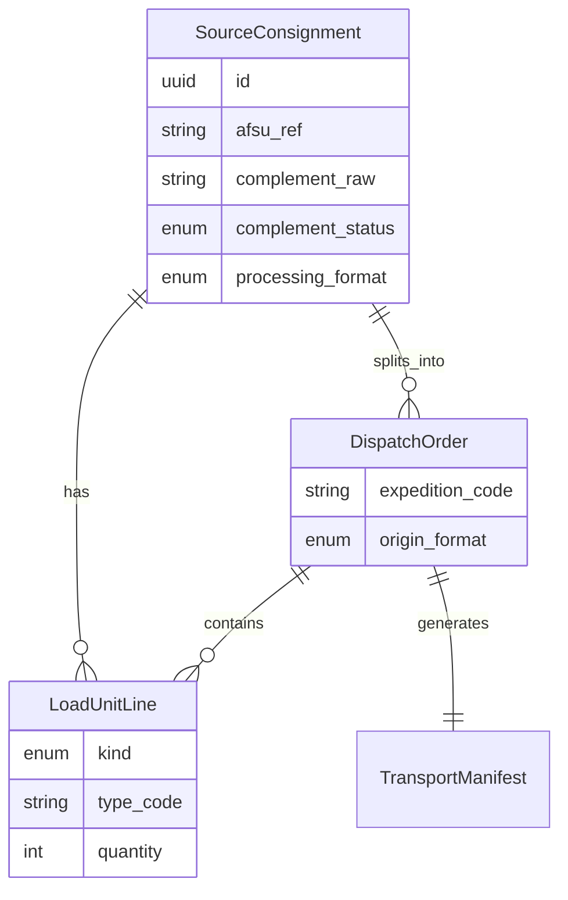

# SPEC: Transport Dispatch — product foundation (AFSU → listy transportowe)

| Field | Value |
|---|---|
| **Date** | 2027-05-24 |
| **Status** | Proposed — specs + kiosk UX; implementation phased |
| **Author** | Operator / product (Composer-ready) |
| **Platform** | Open Mercato `apps/mercato` — **@app module only** |
| **Module id** | `transport_dispatch` |
| **Related specs** | [Format A — complement kiosk](./2027-05-24-transport-format-a-complement-kiosk.md), [Format B — split dispatch kiosk](./2027-05-24-transport-format-b-split-dispatch-kiosk.md) |
| **Reference module** | `apps/mercato/src/modules/crm_2027/` (structure, AGENTS.md, `modules.ts` registration) |

## TLDR

One new app module **`transport_dispatch`** contains **two separate operator formats** (not one blended screen):

| Format | Codename | Purpose |
|--------|----------|---------|
| **A** | `complement_kiosk` | AFSU shipment missing complement → operator picks package + pallet types with **big + tiles** in ~10s |
| **B** | `split_dispatch_kiosk` | AFSU history with mixed packages/pallets → operator **splits** onto expeditions (X/Y), then generates listy |

Downstream Open Mercato entities use a new aggregate **`DispatchOrder`** (dyspozycja transportowa) — not `SalesShipment` / not carrier wizard packages.

## Problem

- Inbound data from **AFSU** often has **tak/nie** complement flags; many rows lack structured package/pallet breakdown in the datepicker feed.
- Operators today need **lista transportowa** output in **two distinct workflows** (manual complement vs split mixed load).
- Existing OM modules (`sales` shipments, `shipping_carriers`) model **e-commerce fulfillment + carrier labels**, not warehouse transport manifests or expedition split.

## What already exists in OM (do not duplicate)

| Area | Module | Use for transport_dispatch |
|------|--------|------------------------------|
| Per-order fulfillment | `sales` → `SalesShipment` | **Do not extend** for lista transportowa |
| Carrier labels | `shipping_carriers` → `CarrierShipment` | Optional future link by `orderId`; not Format A/B |
| Catalog UoM `pallet` | `SPEC-034` | Product selling unit only — not load-unit types |
| UMES / widgets | `crm_2027` pattern | Copy injection + kiosk pages |
| Command bus | shared | `transport_dispatch.*` commands |

**Gap:** No AFSU connector, no transport manifest entity, no kiosk operator UI.

## Terminology (PL / EN)

| Term | Code name | Meaning |
|------|-----------|---------|
| Wysyłka (AFSU) | `SourceConsignment` | Single inbound row from AFSU — **not** `SalesShipment` |
| Jednostka ładunku | `LoadUnitLine` | One package type or pallet type + quantity |
| Dyspozycja transportowa | **`DispatchOrder`** | Operator grouping: which load units go to which **expedition** |
| Ekspedycja | `ExpeditionCode` | Target route/slot (e.g. `X`, `Y`) — configurable dictionary |
| Lista transportowa | `TransportManifest` | Generated export artifact (PDF/CSV/API — later) |
| Uzupełnienie | `complement` | AFSU tak/nie — may be unknown until Format A |

**Why `DispatchOrder`?** Scientific/logistics tone; avoids collision with `shipment` / `przesyłka` already used in sales/carriers. Polish UI label: **Dyspozycja**.

## Four-module roadmap (ideas → later PRs)

| # | Module id | Role | This PR |
|---|-----------|------|---------|
| 1 | **`transport_dispatch`** | Formats A + B kiosks, `DispatchOrder`, manifest stub | **Spec now** |
| 2 | `afsu_bridge` | Pull/sync AFSU API or file drop, normalize `SourceConsignment` | Spec reference only |
| 3 | `load_unit_catalog` | Admin: 5 package types, 10 pallet types, expedition codes | Referenced by A/B |
| 4 | `transport_manifest_export` | Print/PDF/ERP connectors from `TransportManifest` | Phase 3 |

> Today: implement **only module 1** when coding; keep catalog types as seed JSON inside `transport_dispatch` until module 3 exists.

## Module layout (target)

```
apps/mercato/src/modules/transport_dispatch/
  AGENTS.md
  index.ts
  acl.ts
  setup.ts
  events.ts
  data/entities.ts
  data/validators.ts
  migrations/
  commands/
  lib/
    afsu-normalize.ts          # map AFSU → SourceConsignment
    format-a-complement.ts
    format-b-split.ts
  api/
    consignments/queue/route.ts
    format-a/[id]/route.ts
    format-b/[id]/route.ts
    manifests/generate/route.ts
  backend/transport_dispatch/
    page.tsx                   # hub: two big format tiles
    format-a/page.tsx          # kiosk queue
    format-a/[id]/page.tsx
    format-b/page.tsx
    format-b/[id]/page.tsx
  components/kiosk/
    KioskShell.tsx
    BigChoiceTile.tsx
    LoadUnitStepper.tsx
  i18n/pl.json, en.json
```

Register: `apps/mercato/src/modules.ts` → `{ id: 'transport_dispatch', from: '@app' }`.

## Hub screen (module entry)

Two **equal-weight** tiles (kiosk landing):

```
┌─────────────────────────────┐  ┌─────────────────────────────┐
│  FORMAT A                   │  │  FORMAT B                   │
│  Uzupełnij paczki           │  │  Rozdziel na ekspedycje     │
│  Brak danych z AFSU         │  │  Paczki + palety razem      │
│  [ 12 oczekuje ]            │  │  [ 30 / 27 mieszanych ]     │
└─────────────────────────────┘  └─────────────────────────────┘
```

Routes:

- `/backend/transport_dispatch` — hub
- `/backend/transport_dispatch/format-a` — queue
- `/backend/transport_dispatch/format-b` — queue

## Data model (minimal v1)



## ACL

- `transport_dispatch.view` — hub + read queues
- `transport_dispatch.format_a` — complement kiosk
- `transport_dispatch.format_b` — split kiosk
- `transport_dispatch.manage` — catalog overrides, reprocess

## Events (for later automation)

- `transport_dispatch.consignments.imported`
- `transport_dispatch.format_a.completed`
- `transport_dispatch.format_b.completed`
- `transport_dispatch.manifest.generated`

## Constraint

Same as `crm_2027`: **no edits** to `packages/core` unless explicitly approved. Integrate via `@app` module, dictionaries, optional `sales` read-only links.

## Composer / Cursor handoff

When implementing, read in order:

1. This file
2. `2027-05-24-transport-format-a-complement-kiosk.md`
3. `2027-05-24-transport-format-b-split-dispatch-kiosk.md`
4. `apps/mercato/src/modules/transport_dispatch/AGENTS.md` (generated with scaffold)

Branch naming: `cursor/transport-dispatch-<phase>-f6a1`.

## Out of scope (v1 specs)

- Full AFSU API (stub fixtures + manual import OK)
- Auto-split algorithm for Format B (human-first; algorithm later)
- PDF template design (manifest id + JSON payload sufficient)

## Changelog

| Date | Change |
|------|--------|
| 2027-05-24 | Initial foundation + 4-module roadmap + `DispatchOrder` naming |
