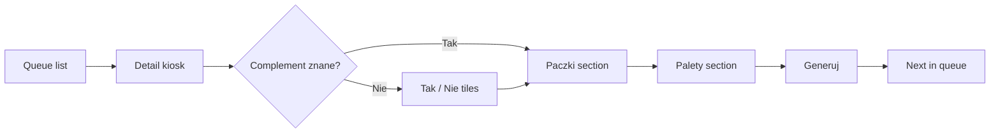

# SPEC: Transport Format A — Complement kiosk (package + pallet picker)

| Field | Value |
|---|---|
| **Date** | 2027-05-24 |
| **Status** | Proposed |
| **Parent** | [transport_dispatch foundation](./2027-05-24-transport-dispatch-product-foundation.md) |
| **Format id** | `complement_kiosk` (FORMAT_A) |
| **Route prefix** | `/backend/transport_dispatch/format-a` |

## User story

As a **warehouse operator**, when AFSU sends a **SourceConsignment** without complement / package breakdown (datepicker gap or `tak`/`nie` only), I open **Format A**, tap package and pallet types with **large + buttons**, and finish in **under 10 seconds** so the system can generate the correct **transport list** output.

## Entry conditions

Show consignment in Format A queue when **any**:

- `complement_status = unknown` (not in datapicker feed)
- `complement_raw` present but **no** `LoadUnitLine` rows yet
- Explicit flag `requires_format_a = true` from `afsu_bridge` import

**Exclude** from Format A (route to Format B instead): rows that already have both package and pallet lines and `processing_format = mixed` (see Format B spec).

## Seed catalog (visualization only — v1)

Assume dictionary / seed config (module 3 later):

**Package types (5)** — example codes:

| Code | Label PL |
|------|----------|
| `PKG_S` | Paczka S |
| `PKG_M` | Paczka M |
| `PKG_L` | Paczka L |
| `PKG_XL` | Paczka XL |
| `PKG_FRAGILE` | Paczka krucha |

**Pallet types (10)** — example codes:

| Code | Label PL |
|------|----------|
| `PLT_EUR` | Paleta EUR |
| `PLT_IND` | Paleta przemysłowa |
| `PLT_HALF` | Półpaleta |
| `PLT_QUARTER` | Ćwierćpaleta |
| `PLT_DISPLAY` | Paleta display |
| `PLT_CAGE` | Klatka |
| `PLT_IBC` | IBC |
| `PLT_OVERSIZE` | Paleta ponadgabaryt |
| `PLT_COLD` | Paleta chłodnia |
| `PLT_CUSTOM` | Inna |

Operator may select **both** families on the same consignment (packages **and** pallets).

## UX principles (kiosk)

- **One consignment per screen** — no tables on the action view.
- **Minimum 48px touch targets**; primary actions bottom-fixed.
- **No dropdowns** for type pick — only tiles + `+` / `−` steppers.
- **Progress**: `3/12` in queue — top bar.
- **Color**: neutral background; selected tile = high-contrast border + count badge.
- Reference inspiration: retail self-checkout, McDonald's kiosk, DHL depot tablets.

## Screen flow



### Queue (`format-a/page.tsx`)

- Large cards: `afsu_ref`, date, complement badge (`?` / `TAK` / `NIE`)
- Sort: oldest first
- Filter chips: `Wszystkie` | `Bez uzupełnienia` | `Tylko NIE`

### Detail (`format-a/[id]/page.tsx`)

**Header**

- AFSU reference (monospace, large)
- Optional: customer / route hint from AFSU payload (read-only)

**Section 1 — Uzupełnienie** (skip if already normalized)

```
┌──────────┐  ┌──────────┐
│   TAK    │  │   NIE    │
└──────────┘  └──────────┘
```

**Section 2 — Paczki** (5 tiles, 2–3 column grid)

Each tile:

```
┌─────────────────┐
│  Paczka M       │
│   [ − ] 2 [ + ] │
└─────────────────┘
```

**Section 3 — Palety** (10 tiles, scrollable grid)

Same stepper pattern.

**Footer (sticky)**

| Button | Action |
|--------|--------|
| **Pomiń** | `complement_status = skipped` + next queue |
| **Generuj listę** | Persist `LoadUnitLine[]`, create `DispatchOrder`(s), emit event |
| **Generuj 2 listy** (optional v1.1) | Split packages vs pallets into two `DispatchOrder` + two manifest stubs — **off by default**; user was unsure |

## Business rules

1. At least **one** `LoadUnitLine` with `quantity > 0` before Generate.
2. Saving writes `processing_format = 'format_a'`.
3. Default **single** `DispatchOrder` with `expedition_code = 'DEFAULT'` unless tenant config maps package/pallet families to different expeditions.
4. Idempotency: re-open completed consignment → read-only view + “Cofnij / popraw” (manage ACL).

## API (sketch)

| Method | Path | Purpose |
|--------|------|---------|
| GET | `/api/transport_dispatch/format-a/queue` | List pending |
| GET | `/api/transport_dispatch/format-a/:id` | Detail + catalog types |
| POST | `/api/transport_dispatch/format-a/:id/complete` | Body: complement, lines[] |

Command: `transport_dispatch.format_a.complete`

## Component checklist (implementation)

- [ ] `KioskShell` — full viewport, no sidebar clutter
- [ ] `BigChoiceTile` — TAK/NIE
- [ ] `LoadUnitStepperGrid` — kind=package|pallet
- [ ] `QueueCounter` — N/M header
- [ ] Haptic-less; keyboard: `+` / `-` on focused tile for desktop dev

## Acceptance criteria

1. Operator can complete a fixture consignment without mouse precision (touch-first).
2. Format A queue **excludes** mixed package+pallet rows destined for Format B.
3. Module registers separately from Format B routes (Composer must not merge screens).
4. Generated payload includes `DispatchOrder` + `TransportManifest.format = 'FORMAT_A'`.

## Open questions (capture in PR, not block spec)

- Should “Generuj 2 listy” ship in v1 or v1.1?
- Exact AFSU field names for `complement_raw` — fill in `afsu_bridge` spec when API known.
