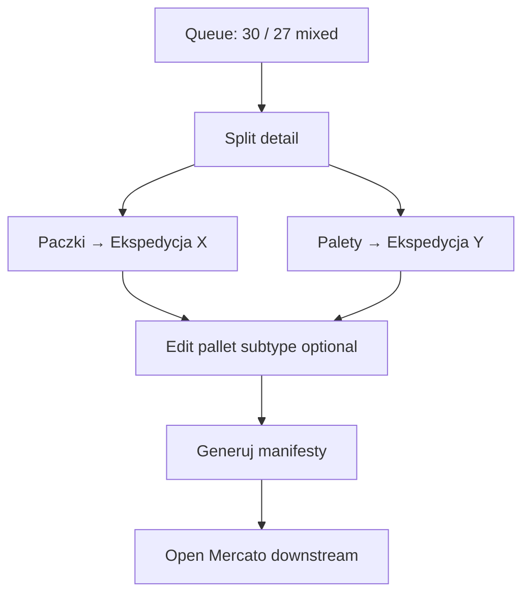
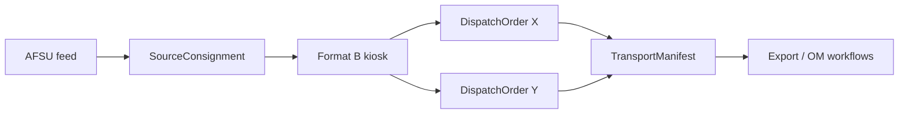

# SPEC: Transport Format B — Split dispatch kiosk (mixed packages + pallets)

| Field | Value |
|---|---|
| **Date** | 2027-05-24 |
| **Status** | Proposed |
| **Parent** | [transport_dispatch foundation](./2027-05-24-transport-dispatch-product-foundation.md) |
| **Format id** | `split_dispatch_kiosk` (FORMAT_B) |
| **Route prefix** | `/backend/transport_dispatch/format-b` |

## User story

As a **warehouse operator**, I see **past AFSU consignments** that already contain **both packages and pallets** (mixed load). I need to **split** them onto expeditions — e.g. packages → **Ekspedycja X**, pallets → **Ekspedycja Y** — adjust pallet subtypes if needed, then **generate** transport lists. The **algorithm** for auto-split comes later; v1 is **human-driven** so we learn rules from real clicks.

## Entry conditions

Queue shows `SourceConsignment` when:

- Has `LoadUnitLine` with `kind = package` **and** `kind = pallet`, OR
- Import flag `load_mix = mixed` from AFSU history
- `processing_format` is null or `format_b_pending`

**Dashboard headline example:**

> **30** nieprzetworzonych · **27** mieszanych (paczki + palety)

## UX principles

Same kiosk rules as Format A, plus:

- **Split view** — two columns (Packages | Palety) with expedition selector per column.
- **Mixed badge** on queue cards — orange “Mieszane”.
- **10-second happy path**: open → confirm split → Generuj (no modal chains).

## Screen flow



## Queue (`format-b/page.tsx`)

**Top stats (big numbers)**

```
   30                    27
nieprzetworzone      mieszane
```

**Card fields**

- `afsu_ref`
- Chips: `3 paczki` `2 palety` `Mieszane`
- Age / date
- CTA: **Rozdziel** (primary)

**Filters**

- `Wszystkie` | `Tylko mieszane` | `Tylko paczki` | `Tylko palety`

## Detail (`format-b/[id]/page.tsx`)

### Layout (two columns, desktop / stacked mobile)

```
┌─────────────────────┬─────────────────────┐
│ PACZKI              │ PALETY              │
│ (summary read-only  │ (editable types     │
│  or steppers)       │  + steppers)        │
│                     │                     │
│ Ekspedycja: [ X ▼] │ Ekspedycja: [ Y ▼] │
└─────────────────────┴─────────────────────┘
```

- **Packages column**: show counts from AFSU/import; allow quantity tweak if business allows.
- **Pallets column**: show pallet **subtype** tiles (10 types) — operator can **change** subtype before generate (user requirement).
- **Expedition selectors**: large segmented control, not small `<select>` — e.g. `X` `Y` `Z` from tenant config.

### Rules preview (inline hint, not algorithm)

Static copy (v1):

> Paczki → ekspedycja X · Palety → ekspedycja Y  
> Inny typ palety? Zmień kafel przed generowaniem.

### Footer

| Button | Action |
|--------|--------|
| **Cofnij** | Back to queue |
| **Generuj** | Create **2+ `DispatchOrder`** (one per expedition column), `TransportManifest` per order or combined — tenant setting |
| **Zapisz szkic** | Save split without manifest (resume later) |

## Data writes

On **Generuj**:

1. `DispatchOrder` #1 — `expedition_code = X`, package lines
2. `DispatchOrder` #2 — `expedition_code = Y`, pallet lines (post-edit)
3. `SourceConsignment.processing_format = 'format_b'`
4. `SourceConsignment.processed_at = now()`
5. Emit `transport_dispatch.format_b.completed`

**Future algorithm hook:** store `split_suggestion_json` on consignment; UI shows “Sugestia: X/Y” ghost text — implement when patterns known.

## Relationship to Open Mercato “new being”

After manifest generation, downstream OM processes **`DispatchOrder`** as the handoff entity (not `SalesShipment`):

- Optional link: `metadata.sales_order_id` for traceability
- Events consumed by ERP/export module (module 4)



## API (sketch)

| Method | Path | Purpose |
|--------|------|---------|
| GET | `/api/transport_dispatch/format-b/queue` | Stats + list |
| GET | `/api/transport_dispatch/format-b/:id` | Split prefilled |
| POST | `/api/transport_dispatch/format-b/:id/complete` | expedition mapping + lines |

Command: `transport_dispatch.format_b.complete`

## Acceptance criteria

1. Queue shows **mixed count** separate from total unprocessed.
2. Operator can assign packages and pallets to **different** expeditions in one screen.
3. Pallet subtype editable before generate.
4. Format B **does not** show Format A complement TAK/NIE flow (separate routes).
5. Spec documents that auto-split is **deferred** — no fake “AI split” in v1.

## Telemetry (learn algorithm later)

Log anonymized:

- `consignment_id`, `package_count`, `pallet_count`, `expedition_x`, `expedition_y`, `pallet_type_codes[]`, `duration_ms`

Store in `transport_dispatch_split_log` table (optional v1 migration).
